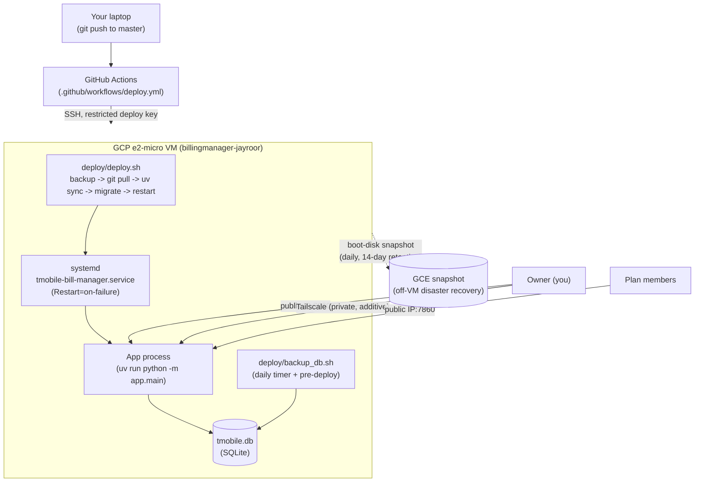

# Deployment Guide

This document covers the Google Cloud VM deployment flow used for this app.

It is aimed at:

- one personal owner account
- a small number of members
- low monthly cost
- mostly-automated deployment, minimal manual VM babysitting

Current deployment style:

- Google Cloud Compute Engine VM (`billingmanager-jayroor`, zone `us-central1-f`, `e2-micro`)
- Ubuntu 25.10 minimal
- SQLite database on the VM
- App managed by **systemd** (`tmobile-bill-manager.service`) - starts on boot, restarts automatically on failure
- Dependencies managed by **uv** (`uv sync --frozen` against the committed `uv.lock`)
- **Tailscale** joins the VM to the owner's private tailnet, as an additional access path alongside the public IP
- **GitHub Actions** auto-deploys on every push to `master` over SSH with a dedicated, restricted deploy key
- Daily **local SQLite backups** (systemd timer) plus a daily **GCE boot-disk snapshot schedule** for real off-VM disaster recovery
- static IP
- no reverse proxy yet, no HTTPS yet (an nginx package happens to be installed but is not wired up to the app)

## Architecture at a glance



Two independent safety nets: the local SQLite backup is for a fast single-file rollback (e.g. a bad migration), and the GCE disk snapshot is for full disaster recovery (lost/corrupted VM or disk entirely) - see "Backups" below for both.

## Current Public URL Pattern

```text
http://34.42.180.111:7860
```

If you later buy a domain and wire DNS correctly, you can switch `APP_BASE_URL` to that domain and add Nginx + HTTPS (not set up yet - see "Recommended Next Hardening Step" below).

## Branching model for deploys

- `master` is the deploy source of truth. The VM always runs `origin/master`, and the GitHub Actions workflow ([.github/workflows/deploy.yml](.github/workflows/deploy.yml)) only triggers on pushes to `master`.
- `dev` is where feature work happens. Merge `dev` into `master` deliberately when a round of work is tested and ready to go live - production is never auto-updated from `dev` directly.
- You can also trigger a deploy manually from the GitHub Actions tab (`workflow_dispatch`) without pushing anything.

## One-time local machine setup (already done once, documented for a future laptop)

You do not need Homebrew for any of this.

### Google Cloud CLI

```bash
mkdir -p ~/google-cloud-sdk-install && cd ~/google-cloud-sdk-install
curl -fL -o gcloud.tar.gz "https://dl.google.com/dl/cloudsdk/channels/rapid/downloads/google-cloud-cli-darwin-arm.tar.gz"
tar -xzf gcloud.tar.gz
./google-cloud-sdk/install.sh --quiet --usage-reporting=false --command-completion=false --path-update=false
echo 'source "$HOME/google-cloud-sdk-install/google-cloud-sdk/path.zsh.inc"' >> ~/.zshrc
echo 'source "$HOME/google-cloud-sdk-install/google-cloud-sdk/completion.zsh.inc"' >> ~/.zshrc
source ~/.zshrc
gcloud auth login
gcloud config set project project-2833c0b8-116a-4b4b-ac5
```

Verify VM access:

```bash
gcloud compute ssh billingmanager-jayroor --zone=us-central1-f --command="echo ok"
```

### GitHub CLI (optional, only needed to manage repo secrets from the terminal)

```bash
curl -fsSL https://api.github.com/repos/cli/cli/releases/latest \
  | grep -o '"browser_download_url": *"[^"]*macOS_arm64\.zip"'
# download + unzip the URL that prints, then:
gh auth login --hostname github.com --git-protocol https --web
```

## VM-side setup

The VM already has `uv` installed (`curl -LsSf https://astral.sh/uv/install.sh | sh`) and the repo cloned at `~/apps/Bill-Manager-App`.

### Dependencies

```bash
cd ~/apps/Bill-Manager-App
export PATH="$HOME/.local/bin:$PATH"
uv sync --frozen
```

### The `.env` File

Unchanged from before - lives only on the VM, is gitignored, and is never touched by deploys. See [app/core/config.py](app/core/config.py) for every variable the app reads. Important: use `KEY=value`, not `export KEY=value` - the app reads this file itself via `python-dotenv`, but if anything ever reads it via systemd's `EnvironmentFile=`, the `export` prefix breaks that parser (and would log the raw value to the journal - see the security note below).

### systemd service

Unit file: [deploy/systemd/tmobile-bill-manager.service](deploy/systemd/tmobile-bill-manager.service). Installed once with:

```bash
sudo cp deploy/systemd/tmobile-bill-manager.service /etc/systemd/system/
sudo systemctl daemon-reload
sudo systemctl enable --now tmobile-bill-manager
```

Useful commands:

```bash
sudo systemctl status tmobile-bill-manager
sudo systemctl restart tmobile-bill-manager
sudo journalctl -u tmobile-bill-manager -n 100 --no-pager
```

Notes:

- `Restart=on-failure` means a crash (or a slow first-boot import race - see below) recovers on its own.
- This `e2-micro`'s baseline vCPU is heavily throttled. A cold start (importing gradio + pandas + matplotlib + plotly + sqlalchemy + twilio + openai) can genuinely take **1-3 minutes** before the app answers HTTP requests, even with warm caches. This is not a bug - budget for it (see the health-check retry loop in `deploy/deploy.sh`) and don't assume the app is broken just because `curl` fails in the first minute after a restart.

### Redeploys

```bash
bash ~/apps/Bill-Manager-App/deploy/deploy.sh
```

See [deploy/deploy.sh](deploy/deploy.sh) - it takes a DB backup, fast-forward-pulls `master`, runs `uv sync --frozen`, runs Alembic migrations, restarts the systemd service, and polls `localhost:7860` until it's healthy (or fails loudly with the exact `journalctl` command to run next).

## GitHub Actions CI/CD

Workflow: [.github/workflows/deploy.yml](.github/workflows/deploy.yml). On every push to `master` (or a manual "Run workflow" click), it SSHes into the VM and triggers `deploy/deploy.sh`.

This uses a **dedicated, restricted deploy key** - not your personal SSH key:

- A separate ed25519 keypair was generated just for CI.
- Its entry in the VM's `~/.ssh/authorized_keys` has a forced command: `command="/home/justineayroor/apps/Bill-Manager-App/deploy/deploy.sh",no-port-forwarding,no-X11-forwarding,no-agent-forwarding,no-pty ssh-ed25519 ...`. Even if this key ever leaked, it cannot run anything except `deploy.sh` on that one VM.
- The private half lives only in the GitHub repo's Actions secrets (`VM_SSH_KEY`), never on disk anywhere else. Repo secrets used: `VM_HOST` (`34.42.180.111`), `VM_USER` (`justineayroor`), `VM_SSH_KEY`.

To rotate this key: generate a new keypair, replace the `authorized_keys` line on the VM, update the `VM_SSH_KEY` GitHub secret, and delete the old private key.

## Tailscale (private access)

The VM is joined to the owner's tailnet under the hostname `billingmanager-jayroor`. This is **additive** - the public IP (`34.42.180.111:7860`) still works exactly as before for plan members. Tailscale just gives the owner a private path to the VM (app UI and SSH) from any device on the tailnet, without depending on the public firewall rule.

Setup performed once:

```bash
# on the VM
curl -fsSL https://tailscale.com/install.sh | sudo sh
sudo tailscale up --ssh --hostname=billingmanager-jayroor
# then open the printed https://login.tailscale.com/a/... URL in a browser
# logged into the same Tailscale account as your other devices
```

Install the Tailscale app on any other device (laptop, phone) and log into the same account to reach the VM privately at its tailnet IP (`tailscale status` shows current IPs on any joined device).

## Backups

Two independent layers:

1. **Local rotating SQLite backups** - [deploy/backup_db.sh](deploy/backup_db.sh), run daily via `tmobile-bill-manager-backup.timer` (see [deploy/systemd/](deploy/systemd/)) and automatically before every `deploy.sh` run. Writes a gzipped, timestamped copy to `~/backups/` on the VM and prunes anything older than 14 days. This is for a fast single-file rollback (e.g. a bad migration), not disaster recovery.
2. **GCE boot-disk snapshot schedule** - `billingmanager-daily-backup`, attached to the VM's boot disk, takes a full incremental disk snapshot daily with 14-day retention. This is the real off-VM/off-disk protection (survives a lost or corrupted VM/disk entirely) and needs **no credentials on the VM at all** - it's a GCP-managed resource policy, set up once from the local machine:

   ```bash
   gcloud compute resource-policies create snapshot-schedule billingmanager-daily-backup \
     --region=us-central1 --max-retention-days=14 --daily-schedule --start-time=09:00 \
     --storage-location=us --on-source-disk-delete=keep-auto-snapshots

   gcloud compute disks add-resource-policies billingmanager-jayroor \
     --zone=us-central1-f --resource-policies=billingmanager-daily-backup
   ```

   To restore from a snapshot: create a new disk from the snapshot (`gcloud compute disks create ... --source-snapshot=...`), then attach it to a VM.

Why not push local backups to a GCS bucket directly from the VM? This project's GCP org policy blocks minting new service-account keys (`constraints/iam.disableServiceAccountKeyCreation`), and the VM's own attached service account only has read-only storage scope (changing instance scopes requires stopping the VM). The disk snapshot schedule sidesteps both problems entirely and is arguably a *better* backup anyway (whole-disk, not just the DB file).

## Testing the Deployment

```text
http://34.42.180.111:7860
```

Verify:

- login page loads
- owner login works
- seeded data appears
- invite and reset email links point to the correct URL
- reminders send correctly
- `sudo systemctl status tmobile-bill-manager` shows `active (running)`
- `systemctl list-timers tmobile-bill-manager-backup.timer` shows a scheduled next run

## Troubleshooting

### Browser cannot reach the app

Check:

- `sudo systemctl status tmobile-bill-manager` - is it actually running? (remember the 1-3 minute cold-start window above)
- `sudo journalctl -u tmobile-bill-manager -n 100 --no-pager` for a traceback
- firewall rule allows `tcp:7860` (GCP Console -> VPC network -> Firewall)
- the VM external IP is correct and still the promoted static IP

### `no such table: members` / migration errors

```bash
cd ~/apps/Bill-Manager-App
uv run python create_db.py
```

### Deploy key doesn't seem to do anything except run deploy.sh

That's intentional - see the forced-command restriction under "GitHub Actions CI/CD" above.

### GitHub Actions run fails in ~15-30 seconds with "Permission denied" / exit 126

`deploy/deploy.sh` (or `deploy/backup_db.sh`) lost its execute bit - the forced SSH command runs it by path, which needs `chmod +x`, unlike a manual `bash deploy/deploy.sh`. Check with `git ls-files -s deploy/deploy.sh` (should show `100755`, not `100644`); fix with `chmod +x deploy/deploy.sh deploy/backup_db.sh`, commit, and push. If you also `chmod +x` directly on the VM as an immediate unblock, do `git checkout -- deploy/*.sh && git pull --ff-only origin master` there afterward, or the next pull will refuse with "local changes would be overwritten by merge". Full incident writeup: [10-deployment-implementation.md](docs/decisions/2026-07-04-roadmap/10-deployment-implementation.md).

### SSH disconnects used to kill the app

No longer applicable - the app runs under systemd now, not in a foreground `tmux` session. `tmux` is not used anymore.

## Recommended Next Hardening Step

1. Nginx reverse proxy in front of Gradio (the package is already installed on the VM, just unused) once you want a cleaner URL.
2. HTTPS, once you have a real domain to point at the static IP.
3. Consider moving the GitHub Actions deploy trigger through Tailscale (via `tailscale/github-action` in the runner) if you ever want to close the public SSH port entirely.

## Security Reminder

If any credentials were pasted into chat, screenshots, terminal logs, or committed by mistake, rotate them:

- SMTP password
- Twilio auth token
- OpenRouter API key
- browser/session secret
- the GitHub Actions deploy SSH key (see rotation steps above)

**Action item from this round:** the `OPENROUTER_API_KEY` was briefly logged in cleartext by `systemd` (it tried to parse `.env`'s `export KEY=value` lines as an `EnvironmentFile` and logged each "invalid" line, including the raw secret, to the journal) before the unit file was fixed to stop using `EnvironmentFile` entirely. The journal was rotated/vacuumed afterward, but the key was also visible in this agent's tool output during that debugging session - **rotate it** at https://openrouter.ai/settings/keys as a precaution.
