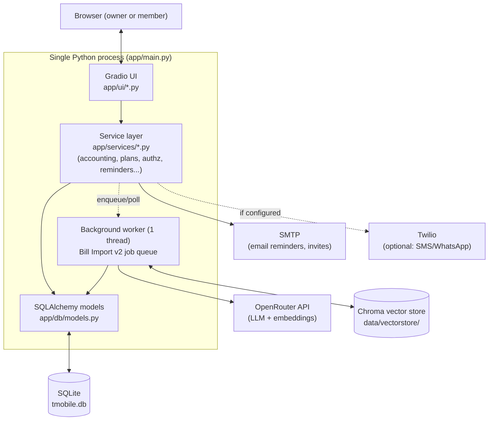
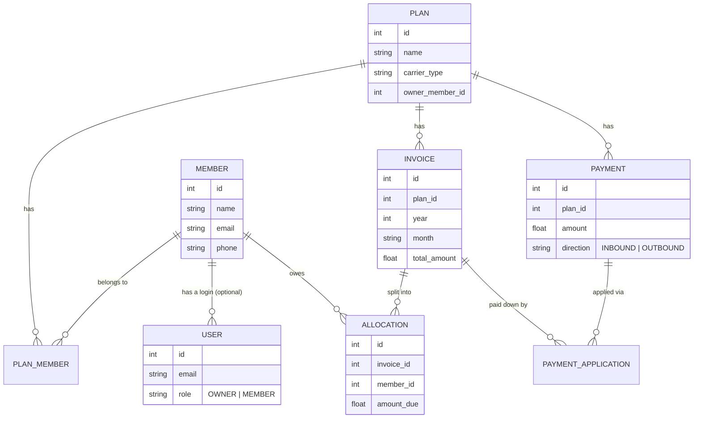
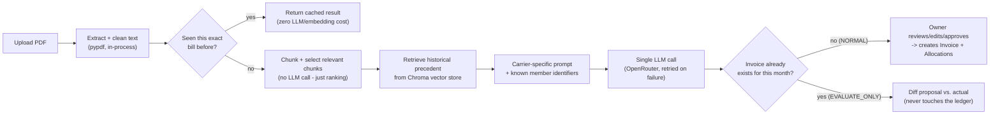

# Bill Manager App

A small, self-hosted app for tracking a shared recurring bill (like a family mobile plan) across multiple people: who owes what, who's paid, and gentle reminders when they haven't.

Built for **one owner/admin + a handful of trusted members** - not a public product, but a real working app you can learn a lot from: multi-tenant-style data scoping, an LLM-assisted document import pipeline, and a genuinely cheap production deployment.

If you're new to this codebase, start here, then go deeper with:

- [SPECIFICATION.md](SPECIFICATION.md) - the full functional + technical spec (roles, data model, every feature in detail)
- [DEPLOYMENT.md](DEPLOYMENT.md) - how it's actually deployed and operated in production
- [docs/decisions/2026-07-04-roadmap/](docs/decisions/2026-07-04-roadmap/00-index.md) - the *why* behind every major design decision, written as it happened

## What it does

- **Plans** - one or more independent "billing groups" (e.g. two different family phone plans), each with its own members and invoices. A single owner account can see everything; a member only sees the plan(s) they belong to.
- **Invoices & allocations** - record what a monthly bill cost in total, and how it's split across members.
- **Bill Import (LLM-assisted)** - upload the actual PDF bill and let an LLM propose the split for you, using your plan's known members/identifiers and history as context. See [How Bill Import works](#how-bill-import-works) below.
- **Payments & applications** - track money coming in from members and going out to the carrier, and apply it against balances.
- **Reminders** - nudge members who owe money, over email (and optionally SMS/WhatsApp via Twilio).
- **Member self-service** - members log in, see only their own data, and manage their own contact preferences and password.

## Architecture at a glance

A single Python process: a Gradio UI talking directly to a service layer, backed by one SQLite file. No separate frontend/backend, no message queue, no external database to run.



Why this shape instead of a "real" microservice/Next.js setup? Because the actual constraint is *low load, personal use, keep it simple* - see [05-deferred-microservice-migration.md](docs/decisions/2026-07-04-roadmap/05-deferred-microservice-migration.md) for the reasoning, revisited and still valid.

## Data model (simplified)



Two more tables support the LLM bill-import pipeline specifically (`BillImportJob`, an audit trail of every import run; `MemberIdentifier`, a generalized "this phone/email/name belongs to this member" lookup) - see [SPECIFICATION.md](SPECIFICATION.md#32-data-model) for the full picture including those.

## Tech stack

| Layer | Choice | Why |
|---|---|---|
| UI | [Gradio](https://gradio.app) | Fast to build a functional multi-tab internal tool without writing a separate frontend |
| Backend | Plain Python service modules | Small enough that a "real" API layer would be premature |
| ORM / migrations | SQLAlchemy + Alembic | Type-safe models, and every schema change is a reviewable, reversible migration file |
| Database | SQLite | Zero ops for this scale (a handful of users); see [SPECIFICATION.md](SPECIFICATION.md) for when this would need to change |
| LLM + embeddings | OpenRouter (model-agnostic) | One API key, swap models via `.env`, no vendor lock-in |
| RAG orchestration | LangChain + Chroma | Retrieval (relevant bill chunks, historical precedent) without hand-rolling vector search |
| Notifications | SMTP (default) + Twilio (optional) | Provider-agnostic interface (`app/services/notifications/`) so losing Twilio access never breaks the reminder system |
| Packaging | [`uv`](https://docs.astral.sh/uv/) | One lockfile (`uv.lock`), fast installs, same tool locally and in production |
| Deployment | Single GCP `e2-micro` VM, `systemd`, GitHub Actions | See [DEPLOYMENT.md](DEPLOYMENT.md) - deliberately the simplest thing that's actually reliable |

## Project structure

```text
app/
  main.py            Entry point - builds and launches the Gradio app
  core/               Environment/config loading (app/core/config.py)
  db/                 SQLAlchemy models (models.py) and session setup
  auth/               Password hashing, login, invite/reset flows
  scripts/            One-off scripts (e.g. create_owner.py)
  services/           All business logic, organized by concern:
    accounting.py         Balance/allocation math
    plans.py, authz.py     Multi-plan support and plan-scoped permissions
    crud.py                Generic create/read/update/delete helpers
    payment_apply.py       Applying payments against invoice balances
    reminder_sender.py     Reminder eligibility + sending
    notifications/         Provider-agnostic notification interface (Email, Twilio)
    bill_import_worker.py  Background job queue for the LLM bill-import pipeline (v2)
    llm_invoice_extract_v2.py, vectorstore.py, embeddings_client.py, member_identifiers.py
                           The RAG pipeline itself - see "How Bill Import works" below
    bill_prompts/          Carrier-specific prompt templates (T-Mobile today, extensible)
  ui/                 Gradio screens (one module per major tab)
alembic/              Schema migrations (one file per change, see alembic/versions/)
eval/                 Model-accuracy evaluation harness + history (eval/run_eval.py)
scripts/              Maintenance scripts (e.g. scripts/rebuild_vectorstore.py)
deploy/               systemd units + deploy.sh + backup_db.sh for production
seed/                 Excel import for migrating in historical spreadsheet data
docs/decisions/       Design-decision write-ups, one per topic, dated by discussion
create_db.py          Creates tables + runs Alembic migrations (safe to re-run)
```

## Quick start (local development)

This project uses [`uv`](https://docs.astral.sh/uv/) - one tool for the virtual environment, dependency locking, and running commands. Install it once:

```bash
curl -LsSf https://astral.sh/uv/install.sh | sh
```

Then, from the project root:

```bash
# 1. Install dependencies (creates .venv automatically, matches the committed lockfile)
uv sync

# 2. Create a .env file (see "Environment Variables" below), then create the database
uv run python create_db.py

# 3. Create the first owner account (you'll be prompted for email + password)
uv run python -m app.scripts.create_owner

# 4. Run it
uv run python -m app.main
```

Open **http://127.0.0.1:7860**.

> Prefer plain `pip`? `python -m venv .venv && source .venv/bin/activate && pip install -e .` still works - `uv` is just faster and guarantees you get the exact versions in `uv.lock`.

### Optional: import historical data from a spreadsheet

If you're migrating from a tracking spreadsheet:

```bash
uv run python seed/seed_excel.py data/seed_clean.xlsx
```

Expects `allocations` and `transactions` sheets; creates members and invoices as needed. Run this *after* `create_db.py`, and only if you actually have historical data to bring in - a brand-new setup can skip it entirely.

## Environment Variables

Create a `.env` file in the project root (never commit it - see [Security Notes](#security-notes)):

```env
# --- Email (used for reminders, invites, password resets) ---
SMTP_HOST=smtp.gmail.com
SMTP_PORT=587
SMTP_USERNAME=your-email@gmail.com
SMTP_PASSWORD=your-app-password
FROM_EMAIL=your-email@gmail.com

# --- LLM bill import (both the legacy and v2/RAG pipeline) ---
OPENROUTER_API_KEY=your-openrouter-key
OPENROUTER_BASE_URL=https://openrouter.ai/api/v1
OPENROUTER_MODEL=openai/gpt-4o-mini
OPENROUTER_EMBEDDING_MODEL=openai/text-embedding-3-small
OPENROUTER_SITE_URL=http://localhost:7860
OPENROUTER_APP_NAME=tmobile-bill-manager

# --- Optional: Twilio for SMS/WhatsApp reminders (Email always works without this) ---
TWILIO_ACCOUNT_SID=your-twilio-account-sid
TWILIO_AUTH_TOKEN=your-twilio-auth-token
TWILIO_SMS_FROM=+15551234567
TWILIO_WHATSAPP_FROM=whatsapp:+14155238886
TWILIO_STATUS_CALLBACK_URL=

# --- App-wide ---
APP_BASE_URL=http://localhost:7860
TM_BILL_BROWSER_STATE_SECRET=change-this-in-non-local-envs
```

Notes:

- Plain `KEY=value` lines - do **not** prefix with `export` (breaks systemd's env parsing in production, see [DEPLOYMENT.md](DEPLOYMENT.md)).
- `APP_BASE_URL` is what invite/reset emails link to - set it to wherever users will actually click from (`http://localhost:7860` locally, your real public URL in production).
- If Twilio isn't configured, the app gracefully hides SMS/WhatsApp reminder options rather than failing - Email is the only channel that's always assumed to work. See [02-notifications-strategy.md](docs/decisions/2026-07-04-roadmap/02-notifications-strategy.md) for why.
- The RAG v2 bill-import config (`OPENROUTER_EMBEDDING_MODEL`, `VECTOR_RETRIEVAL_LOOKBACK_MONTHS`, `BILL_IMPORT_MAX_JOBS_PER_HOUR_PER_PLAN`, `BILL_TEXT_RETENTION_DAYS`) all have sensible defaults in [app/core/config.py](app/core/config.py) - you only need to set them to override the defaults.

## Feature tour

### Plans, roles, and who can see what

Every piece of data (invoices, payments, members) belongs to a **Plan**. There are two kinds of login:

| Role | Can do |
|---|---|
| **OWNER** (one app-wide admin) | See and edit every plan; a synthetic "All Plans (combined)" view for cross-plan totals |
| **MEMBER** | See only the plan(s) they belong to; can *edit* a plan only if they're that plan's designated owner (`Plan.owner_member_id`) - otherwise read-only |

A global "Active plan" dropdown scopes the whole UI to one plan at a time, so the same screens work whether you have one plan or ten. Member-record edits have a finer rule on top: a MEMBER can only edit a member *they personally added* to a plan; removing someone from a plan at all is OWNER-only. See [authz.py](app/services/authz.py) and [06-multi-plan-authorization-and-global-selector.md](docs/decisions/2026-07-04-roadmap/06-multi-plan-authorization-and-global-selector.md) / [07-member-management-authorization.md](docs/decisions/2026-07-04-roadmap/07-member-management-authorization.md) for the full rules and rationale.

### How Bill Import works

There are two import paths, side by side:

- **Legacy flow** - a synchronous, one-shot LLM call. Still available, collapsed under "advanced" in the UI.
- **Bill Import v2 (RAG)** - visible by default. Upload a PDF; it's cleaned, matched against your plan's known members, and the LLM proposes a full invoice + per-member split for you to review and approve.



Why not just send the whole PDF to the LLM every time? Cost and speed - identical re-uploads are cached by content hash, the "chunk selection" step trims what's sent without an extra LLM call, and the vector store only ever stores small "outcome fact" strings (never raw bill text) as historical context. The full reasoning (including why SQLite over a vector-DB-only approach, and how caching/rate-limiting works) is in [08-llm-bill-import-rag-architecture.md](docs/decisions/2026-07-04-roadmap/08-llm-bill-import-rag-architecture.md).

An owner-only **"Inspect a job"** view shows exactly what was sent to the LLM and what it cost; an owner-only **Admin Eval Dashboard** tracks accuracy over time and across models.

### Reminders

Owners can send balance reminders over email (always available) and, if configured, SMS/WhatsApp via Twilio. Every attempt is logged (`ReminderLog`) with delivery status, visible to both the owner and the member it was sent to.

## Common Commands

```bash
uv run python create_db.py                          # create tables + run migrations (safe to re-run)
uv run python -m app.scripts.create_owner            # create the first owner login
uv run python seed/seed_excel.py data/seed_clean.xlsx # optional: import historical spreadsheet data
uv run python -m app.main                            # run the app
uv run python scripts/rebuild_vectorstore.py         # rebuild the RAG v2 vector store from approved invoices
uv run python eval/run_eval.py --models openai/gpt-4o-mini --limit 20  # compare LLM model accuracy
```

## Troubleshooting

**`sqlite3.OperationalError: no such table: members`** - run `uv run python create_db.py`.

**`ModuleNotFoundError: No module named 'app'` while seeding** - run the command from the project root; `uv run` handles `PYTHONPATH` for you automatically (no need to set it manually like with plain `python`).

**Invite/reset email links point to the wrong address** - fix `APP_BASE_URL` in `.env` and restart the app.

**Deploying, or the app going down when you close your terminal?** - that's covered end-to-end in [DEPLOYMENT.md](DEPLOYMENT.md); production doesn't run this way at all (it's a `systemd` service, not a foreground process).

## Security Notes

- Never commit `.env`.
- Rotate any credential that was ever pasted into chat, a screenshot, a log, or a commit by mistake.
- Set a real, random `TM_BILL_BROWSER_STATE_SECRET` in any shared or deployed environment (the default is explicitly a placeholder).
- For anything beyond local development, see [DEPLOYMENT.md](DEPLOYMENT.md) for the actual production setup (static IP, systemd, backups, CI/CD).

## Where to go next

- **Understand the full spec** (every role/permission rule, every table, every constraint): [SPECIFICATION.md](SPECIFICATION.md)
- **Deploy it yourself**: [DEPLOYMENT.md](DEPLOYMENT.md)
- **Understand *why* it's built this way**, including alternatives that were considered and rejected: [docs/decisions/2026-07-04-roadmap/00-index.md](docs/decisions/2026-07-04-roadmap/00-index.md)
