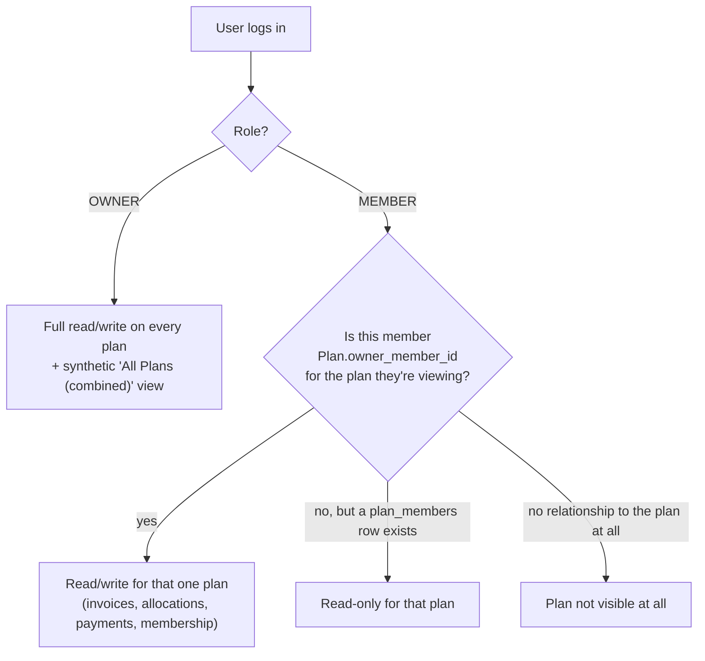
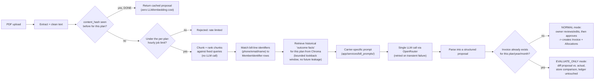
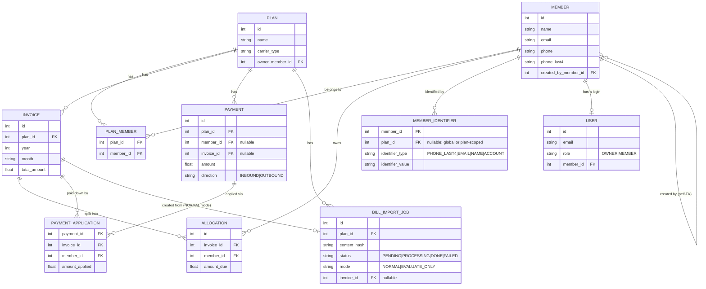

# Bill Manager App Specification

This document is the deep functional + technical spec: every role, every permission rule, every table, and the current constraints. If you just want to get the app running, see [README.md](README.md) instead - come back here when you want to understand *exactly* how something works or decide whether a change is safe.

For the reasoning behind each major decision (alternatives considered, why they were rejected), see [docs/decisions/2026-07-04-roadmap/](docs/decisions/2026-07-04-roadmap/00-index.md).

## 1. Product Summary

Bill Manager App is a lightweight shared-bill tracking system for one **owner** (the application admin) and any number of **plans** - independent groups of members who share recurring invoices (e.g. two separate family mobile plans, each with its own members and bills).

The core loop, per plan:

1. A bill arrives (e.g. the monthly T-Mobile invoice).
2. It's recorded as an `Invoice`, split into per-member `Allocation`s - either entered by hand or proposed by the LLM bill-import pipeline.
3. Members pay their share; `Payment`s are recorded and applied against invoice balances (`PaymentApplication`).
4. The owner (or that plan's designated member-owner) sends reminders to whoever still owes money.
5. Members log in and see only their own relevant data - balances, invoices, reminder history.

This app is intentionally optimized for a small private, trusted user base - not a public consumer product.

## 2. Functional Specification

### 2.1 Roles and Plan-Scoped Authorization

There are exactly two login roles, but permissions are **plan-scoped**, not global:



- **OWNER** - the single application administrator. Full read/write access to every plan, plus a cross-plan "All Plans (combined)" analytics view. There is conceptually one owner (or a small number of trusted admin logins), not one per plan.
- **MEMBER** - can create a new plan (becoming that plan's designated owner via `Plan.owner_member_id`), and can belong to any number of other plans as a read-only participant. Within a plan they don't own, a member sees their own balances/invoices/reminders but cannot create or edit anything.

A global **"Active plan"** dropdown (populated from `authz.accessible_plan_choices()`) scopes the whole UI to one plan at a time - every screen (Invoices, Payments, Bill Import, Members) reads and writes against whichever plan is currently selected, so the same UI works identically whether there's one plan or ten.

See [app/services/authz.py](app/services/authz.py) for the actual permission functions (`can_manage_plan`, `can_view_plan`, `can_manage_member`, `can_delete_plan_member`) and [06-multi-plan-authorization-and-global-selector.md](docs/decisions/2026-07-04-roadmap/06-multi-plan-authorization-and-global-selector.md) for the design rationale.

#### Member-record permissions (a finer rule on top of plan authorization)

- **Removing** a member from a plan is **OWNER-only** - no MEMBER, even a plan's own designated owner, may remove another person from a plan.
- **Editing** a member's profile (name/contact/reminder preferences): the OWNER can edit anyone; a MEMBER can only edit a member *they personally created* (`Member.created_by_member_id`). Members with no recorded creator (legacy data, or created by the OWNER) are editable only by the OWNER.

See [07-member-management-authorization.md](docs/decisions/2026-07-04-roadmap/07-member-management-authorization.md).

### 2.2 Authentication

- Email/password login, passwords hashed with bcrypt.
- Owner account bootstrap script (`app/scripts/create_owner.py`) for the very first login.
- Member account creation and linking (an owner or plan-owning member links a `Member` record to a login `User`).
- Password reset code flow (time-limited token, emailed).
- Browser session persistence via Gradio's `BrowserState` component (not server-side sessions).

### 2.3 Plans

- A `Plan` has a name, an optional `carrier_type` (drives which LLM prompt/anchors the bill-import pipeline uses - `T-Mobile` today, extensible to others), and an `owner_member_id`.
- `PlanMember` is the many-to-many join: a person can belong to multiple plans (e.g. the same person owns one plan and is just a read-only participant in another).
- Creating a plan is available to any MEMBER-role login (they become that plan's owner) as well as the OWNER.

### 2.4 Member Management

- Owner (or a plan-owning member, for members they created) maintains member records: name, email, phone, and reminder channel preferences (`email_enabled`, `sms_enabled`, `whatsapp_enabled`).
- If a member's email matches an existing login, that login can be linked; otherwise, a new login can be created and an invite email sent.
- See 2.1 above for exactly who can edit/remove which members.

### 2.5 Invoice and Allocation Management

- Invoices are scoped to a plan and a `(year, month)` (unique per plan - two plans can each have their own invoice for the same calendar month).
- Each invoice's total is split across members via `Allocation` rows (`amount_due` per member per invoice).
- Allocations can be entered manually, or proposed by either bill-import pipeline (below) and then reviewed/approved by the owner.
- Member invoice visibility is limited to invoices for plans they belong to.

### 2.6 Bill Import (LLM-Assisted) - Two Pipelines Side by Side

**Legacy pipeline** (`app/services/llm_invoice_extract.py`, `app/ui/bill_import.py`'s original flow) - a single synchronous LLM call per upload. Still fully functional, now collapsed under an "advanced" section in the UI since v2 is the default.

**Bill Import v2 (RAG, opt-in but visible by default)** - a cost-conscious retrieval-augmented pipeline built *alongside*, not replacing, the legacy flow:



Key design points (see [08-llm-bill-import-rag-architecture.md](docs/decisions/2026-07-04-roadmap/08-llm-bill-import-rag-architecture.md) for full rationale):

- **Every run is logged** in `BillImportJob` - the exact system prompt, the known roster sent, token usage/cost, cache-hit count, and the raw LLM response. This is both an audit trail and the golden dataset for the evaluation harness.
- **No PDF is ever stored** - only the cleaned text (a few KB), keyed by a content hash so re-uploading the same bill is free.
- **Historical precedent has no future leakage** - when scoring/reviewing a bill for month N, only outcome facts from *before* month N are retrievable.
- **Generalized member identifiers** (`MemberIdentifier`: `PHONE_LAST4`, `EMAIL`, `NAME`, `ACCOUNT`) replace a phone-number-only assumption, since not every carrier's bill has phone numbers as the identifying field.
- **Unmatched/shared amounts** default to an equal split among members who actually matched a line on *this* bill (not the full plan roster) - see [09-bill-import-v2-manual-test-plan.md](docs/decisions/2026-07-04-roadmap/09-bill-import-v2-manual-test-plan.md) for the test cases that pin this behavior down.
- **Once a NORMAL-mode job is approved, it becomes read-only** in the Bill Import UI - further edits happen from the Invoices & Allocations screen, which is the single source of truth from that point on.

An owner-only **"Inspect a job"** view surfaces the raw prompt/response/cost for any job. An owner-only **Admin Eval Dashboard** (`app/ui/eval_dashboard.py`) tracks prediction accuracy over time and across models, backed by `eval/history.jsonl` and `eval/run_eval.py` (a CLI tool for comparing multiple models head-to-head).

### 2.7 Payments and Applications

- `Payment` rows are scoped to a plan, with a `direction` (`INBOUND` = member paid the owner, `OUTBOUND` = owner paid the carrier/other) and an optional link to a member and/or invoice.
- `PaymentApplication` rows record how a payment was applied against a specific invoice/member balance - a single payment can be split across multiple invoices.
- Balances are always recomputed from `Allocation` + `PaymentApplication`, never stored as a running total, so they can't drift out of sync.

### 2.8 Reminder System

- Channels: Email (always assumed available), SMS and WhatsApp (both via Twilio, only if configured - see 2.9).
- Only the OWNER (or, per the plan-authorization model, a plan-owning MEMBER for their own plan) can trigger reminders.
- Every attempt is logged in `ReminderLog` with delivery status/provider metadata, visible to both the owner and the member it concerns.

### 2.9 Notifications: Provider Abstraction

Twilio access for this project was rejected/unavailable at one point, which motivated a provider-agnostic redesign (`app/services/notifications/`):

- `NotificationProvider` is a small interface (`base.py`) that any channel implements.
- `EmailProvider` and `TwilioProvider` are the two current implementations; `registry.py` maps channels (`EMAIL`, `SMS`, `WHATSAPP`) to a provider instance.
- `TWILIO_CONFIGURED` (and per-channel `TWILIO_SMS_CONFIGURED`/`TWILIO_WHATSAPP_CONFIGURED`) flags in [app/core/config.py](app/core/config.py) let the UI gracefully hide unavailable channels instead of failing at send time.
- Adding a new channel later (Telegram, Pushover, a different SMS API) means writing one class and adding one registry line - no UI or reminder-eligibility code changes.

See [02-notifications-strategy.md](docs/decisions/2026-07-04-roadmap/02-notifications-strategy.md).

### 2.10 Seed Import

An Excel import path (`seed/seed_excel.py`) bootstraps historical spreadsheet data into the app - imports allocations and transactions, creating members/invoices as needed, scoped to a target plan (defaults to a migrated "Default Plan" for pre-existing data). Mainly useful for the one-time move from spreadsheet-based tracking into the app.

## 3. Technical Specification

### 3.1 Application Architecture

A Python monolith, one process, with a simple layered structure:

```text
Gradio UI (app/ui/) -> Service layer (app/services/) -> SQLAlchemy models (app/db/) -> SQLite
                                    |
                                    +-> Background worker thread (Bill Import v2 job queue)
                                    +-> OpenRouter (LLM + embeddings)
                                    +-> Chroma vector store (data/vectorstore/)
                                    +-> SMTP / Twilio (notifications)
```

No separate API layer, no message queue, no container orchestration - deliberately, given the actual load ("personal use and learning," not a public product). See the architecture diagram in [README.md](README.md#architecture-at-a-glance) for the fuller picture including the background worker.

### 3.2 Data Model



`ReminderLog` (not shown above for space) is a flat table keyed to `member_id`, recording channel, provider, delivery status, and the outstanding amount at send time.

### 3.3 Main Technical Components

| Component | Where |
|---|---|
| UI | `app/ui/` - one module per major tab (`screens.py` for the core ledger tabs, `plans_tab.py`, `bill_import.py`, `eval_dashboard.py`) |
| Business logic | `app/services/` - accounting/balance math, plan authorization, reminders, notifications, the RAG bill-import pipeline |
| Auth | `app/auth/` - password hashing (`security.py`) and login/invite/reset flows (`service.py`) |
| Data | `app/db/models.py` (SQLAlchemy ORM) + Alembic migrations (`alembic/versions/`) |
| Integrations | SMTP (email), Twilio (SMS/WhatsApp, optional), OpenRouter (LLM + embeddings) |

### 3.4 Key Files

- Entry point: [app/main.py](app/main.py)
- Config/env loading: [app/core/config.py](app/core/config.py)
- Database models: [app/db/models.py](app/db/models.py)
- Plan authorization: [app/services/authz.py](app/services/authz.py)
- Bill Import v2 pipeline: [app/services/bill_import_worker.py](app/services/bill_import_worker.py), [app/services/llm_invoice_extract_v2.py](app/services/llm_invoice_extract_v2.py), [app/services/vectorstore.py](app/services/vectorstore.py)
- Notification providers: [app/services/notifications/](app/services/notifications/)
- Database bootstrap: [create_db.py](create_db.py)
- Seed importer: [seed/seed_excel.py](seed/seed_excel.py)

### 3.5 Environment and Configuration

The app depends on environment variables for SMTP, Twilio (optional), OpenRouter (LLM + embeddings), the RAG pipeline's tunables (lookback window, rate limits, text retention), app base URL, and the browser session secret. Full list with defaults: [README.md's Environment Variables section](README.md#environment-variables) and [app/core/config.py](app/core/config.py) directly.

Current data model assumptions:

- one SQLite database file, shared across all plans
- low write concurrency (a handful of trusted users, not a public product)
- no PDF storage (the bill-import pipeline only persists cleaned text, never the original file)

### 3.6 Deployment Model (current, in production)

- Google Cloud Compute Engine, single `e2-micro` VM, Ubuntu 25.10 minimal, static external IP.
- Dependencies via `uv sync --frozen` against a committed lockfile - same tool locally and in production.
- Process supervision via `systemd` (`tmobile-bill-manager.service`) - starts on boot, restarts on failure. No more `tmux`.
- CI/CD: GitHub Actions triggers a deploy script over SSH (a dedicated, restricted deploy key) on every push to `master`.
- Two-layer backups: daily local SQLite backups (fast single-file rollback) + a daily GCE boot-disk snapshot schedule (real off-VM disaster recovery, no credentials needed on the VM).
- Tailscale as an additive private access path alongside the public IP.
- No reverse proxy or HTTPS yet - see Section 6 for what's still open.

Full details, exact commands, and the incidents hit along the way: [DEPLOYMENT.md](DEPLOYMENT.md), [10-deployment-implementation.md](docs/decisions/2026-07-04-roadmap/10-deployment-implementation.md), and [12-gcp-tailscale-backups-reference.md](docs/decisions/2026-07-04-roadmap/12-gcp-tailscale-backups-reference.md).

### 3.7 Performance Expectations

Expected usage envelope: fewer than 100 users, low concurrent activity, light transaction volume, mostly admin-driven. SQLite is entirely adequate at this scale - see Section 5.3 below for what would actually force a change.

### 3.8 Current Constraints and Risks

- **SQLite** is not built for high write concurrency - fine today, would need to change if usage grew substantially (many simultaneous plans/owners writing at once).
- **Gradio** is productive for an internal tool but has real UI/UX ceiling compared to a dedicated frontend - acceptable tradeoff while functionality is still the priority (see [05-deferred-microservice-migration.md](docs/decisions/2026-07-04-roadmap/05-deferred-microservice-migration.md)).
- **No reverse proxy or HTTPS yet** - the app is served plaintext HTTP over a raw IP:port. Fine for the current trust level, not fine if this ever needed a real domain or public-facing use.
- **The production VM is resource-constrained**: as of the most recent deploy (adding the RAG v2 dependencies - `chromadb`, `langchain`, `onnxruntime`, etc.), disk sits around 83% used and idle memory headroom is a few hundred MB. Not currently a problem, but worth a proactive disk resize before it becomes one - see [11-dev-to-master-promotion.md](docs/decisions/2026-07-04-roadmap/11-dev-to-master-promotion.md).
- **Twilio access was rejected/is unavailable** for this project - the notification-provider abstraction (2.9) exists specifically so this doesn't block reminders entirely; Email is the reliable fallback channel.
- **No automated test suite yet** - see Section 4.3.

## 4. Non-Functional Expectations

### 4.1 Security

- Passwords hashed (bcrypt); inactive users cannot authenticate.
- Members are scoped to their own data; owner-only actions stay owner-only (see 2.1's plan-authorization model, which is considerably more granular than a flat owner/member split).
- Secrets stay in `.env`, never committed; production secrets are never passed through `systemd`'s `EnvironmentFile=` (see the incident writeup in [10-deployment-implementation.md](docs/decisions/2026-07-04-roadmap/10-deployment-implementation.md) - a real leak happened this way and was fixed).
- Still recommended: rotate any credential ever pasted into chat/logs/screenshots; use a strong, non-default `TM_BILL_BROWSER_STATE_SECRET` in any shared/deployed environment; eventually add HTTPS.

### 4.2 Reliability

Now considerably hardened compared to the original `tmux`-based setup:

- `systemd` with `Restart=on-failure` - a crash (or the VM's known slow cold-start race) self-heals.
- Automated CI/CD deploys with a pre-migration backup and a post-deploy health check that fails loudly (with the exact `journalctl` command to run) if the app doesn't come up healthy.
- Two-layer backup strategy (Section 3.6) with a documented, tested restore procedure.

Still open: no reverse proxy/HTTPS, and disk/memory headroom on the VM is worth monitoring (Section 3.8).

### 4.3 Maintainability

- The codebase stays reasonably compact and layered - business logic centralized in `app/services/`, not scattered through UI callbacks.
- Growing complexity to watch: `app/ui/screens.py` and `app/ui/bill_import.py` are large files carrying a lot of stateful Gradio interaction logic; a good candidate for future splitting if they keep growing.
- No automated test suite yet - validation currently relies on a detailed manual test plan ([09-bill-import-v2-manual-test-plan.md](docs/decisions/2026-07-04-roadmap/09-bill-import-v2-manual-test-plan.md)) plus dry-running migrations against a real production-data copy before every promotion (see [11-dev-to-master-promotion.md](docs/decisions/2026-07-04-roadmap/11-dev-to-master-promotion.md)). Adding `pytest` coverage around auth/authz/reminders/allocation math would be the highest-leverage next investment here.

## 5. Product Assumptions

- One real owner/admin is in charge; plan owners are trusted, known people - not anonymous signups.
- Onboarding is owner/plan-owner-driven, not self-serve public registration.
- This is a private coordination tool, not an open marketplace app; the user base per plan is small and trusted.

These assumptions are why the architecture stays deliberately simple - see Section 7.

## 6. Future Thinking

### 6.1 Already done (formerly "near-term improvements")

For historical context, everything below was on the original near-term roadmap and is now **done**:

- ~~`systemd` service for automatic app startup~~ - done.
- ~~Multi-plan support, including full plan-scoping for every tab (Invoices, Bill Import, Payments, Applications, Dashboard, Reminders) and a global "Active plan" selector~~ - done ([04-multi-plan-schema.md](docs/decisions/2026-07-04-roadmap/04-multi-plan-schema.md), [06](docs/decisions/2026-07-04-roadmap/06-multi-plan-authorization-and-global-selector.md)).
- ~~LLM bill-import accuracy improvements + evaluation loop~~ - done ([08](docs/decisions/2026-07-04-roadmap/08-llm-bill-import-rag-architecture.md)).
- ~~CI/CD, automated backups~~ - done ([10](docs/decisions/2026-07-04-roadmap/10-deployment-implementation.md)).

### 6.2 Actually near-term now

- Nginx reverse proxy + HTTPS (once there's a real domain to point at the static IP).
- Proactive VM disk resize given current 83% usage (cheap, no-downtime `gcloud compute disks resize`).
- Automated test coverage (pytest) around auth, plan authorization, and allocation/balance math.

### 6.3 Medium-Term

- Richer reminder scheduling/automation (currently owner-triggered, not scheduled).
- Reminder templates per channel.
- Export tools for balances/payments/reminder history.
- Invoice attachments/bill file archive (currently deliberately *not* storing PDFs at all - would need a real storage decision first).
- Move from SQLite to Postgres, if concurrency/durability needs actually grow past what a single VM + SQLite can handle.

### 6.4 Long-Term / Deferred by Design

- A proper Fastify/Next.js frontend + API layer, with real rate limiting and cost controls on LLM calls - deliberately deferred until the Gradio-based functionality is "spot on," per [05-deferred-microservice-migration.md](docs/decisions/2026-07-04-roadmap/05-deferred-microservice-migration.md). Revisit if/when Gradio's UI ceiling actually becomes the bottleneck, not before.
- Managed database, containerized deployment, more advanced access/permission models - only if real usage growth demands it.

## 7. Recommended Operating Posture

Keep the architecture simple; avoid premature complexity; harden only as real usage demands it. Concretely, that now means:

- Single VM + SQLite + `systemd` + `uv` + CI/CD - already in place, revisit only if load genuinely changes.
- Nginx + HTTPS next, once there's a domain.
- Postgres only if the app actually outgrows SQLite's concurrency ceiling.
- A dedicated frontend/API layer only after the Gradio-based product is functionally complete and stable.

## 8. Summary

Bill Manager App is a practical, privately-hosted shared-bill management tool with:

- multi-plan support with plan-scoped, granular authorization (not just a flat owner/member split)
- allocation and payment tracking with balances always recomputed from source data, never drifted
- an LLM-assisted bill-import pipeline (two generations - legacy synchronous, and a cost-conscious RAG v2 with caching, rate limiting, and an accuracy-evaluation harness)
- multi-channel reminders behind a provider-agnostic notification interface
- member self-service preferences, invite, and password-reset flows
- Excel migration support for historical data
- a genuinely low-cost, reasonably hardened production deployment (systemd, CI/CD, two-layer backups, Tailscale)

Its architecture is appropriate for a small trusted user base today and can keep evolving incrementally - each major change so far has been additive and non-disruptive to existing production data, and that's a deliberate, ongoing constraint, not an accident.
