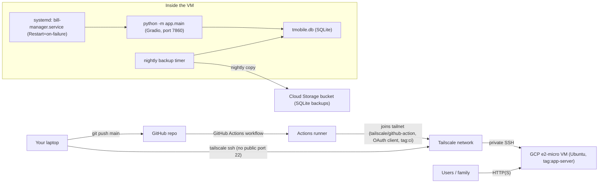

# Deployment & GCP Architecture

## Problem

The app is currently deployed by hand on a GCP `e2-micro` Ubuntu VM:

- SSH in (via the GCP browser console, which disconnects often)
- `source .venv/bin/activate`
- `python -m app.main` inside a `tmux` session so it survives SSH disconnects

There is no process supervisor, no CI/CD, and no reverse proxy/HTTPS. When the VM reboots (maintenance, crash, manual restart) or the process dies for any reason, the app stays down until someone manually SSHes in and restarts it inside `tmux`. There's also no easy way to redeploy after a code change other than `git pull` + manual restart.

## Decisions

- **Process supervision**: replace `tmux` with a `systemd` service (`bill-manager.service`) that auto-starts on VM boot and auto-restarts on crash (`Restart=on-failure`). `tmux` remains available only for ad-hoc manual debugging.
- **Remote access**: use **Tailscale** instead of the GCP browser SSH console or a public port 22. This gives a stable private network path to the VM (`tailscale ssh <hostname>`) that doesn't depend on the browser console and lets the public firewall stay locked down to just the app port (or even that can move behind Tailscale later if public access isn't needed for all users).
- **CI/CD**: go all the way to automated deploys - a GitHub Actions workflow triggers on every push to `main`, joins the same Tailscale network as an ephemeral, tagged CI node (`tailscale/github-action@v4` with an OAuth client, no long-lived SSH keys in GitHub Secrets), SSHes to the VM, and runs a deploy script (`git pull`, sync dependencies, run Alembic migrations, restart the systemd service, health-check).
- **Backups**: nightly SQLite backup (`sqlite3 .backup`) shipped to a Cloud Storage bucket, since SQLite is the only datastore and there's currently no backup story at all.
- **Stay on a single VM** rather than moving to Cloud Run / Cloud SQL / GKE.

## Why a single VM instead of Cloud Run / managed Postgres / Kubernetes

Given the constraints explicitly stated - **no expected high load, personal use and learning only** - a single low-cost VM is the right shape:

| Option | Verdict | Reasoning |
|---|---|---|
| Single `e2-micro` VM + systemd + Tailscale + CI/CD | **Chosen** | Already free-tier eligible, matches current SQLite storage model, minimal new operational surface area, good learning value (systemd, Tailscale, GitHub Actions are all broadly useful skills) |
| Cloud Run + Cloud SQL | Rejected for now | Adds real monthly cost (Cloud SQL has no meaningful free tier), requires migrating SQLite -> Postgres before it's even needed, cold starts are awkward for a stateful Gradio app with in-memory session/browser-state behavior |
| GKE / containers-as-a-fleet | Rejected | Massive operational overhead for a single-user personal tool; no scaling need to justify it |

This can be revisited later if usage genuinely grows (more concurrent users, need for zero-downtime deploys, or outgrowing SQLite) - see [Multi-Plan Schema Scaling](04-multi-plan-schema.md) and the [deferred microservice notes](05-deferred-microservice-migration.md) for what that evolution could look like.

## Target architecture

## Deliverables

- `deploy/bill-manager.service` - systemd unit
- `deploy/deploy.sh` - idempotent redeploy script
- `.github/workflows/deploy.yml` - CI/CD workflow using `tailscale/github-action@v4`
- `deploy/backup_db.sh` + systemd timer - nightly SQLite backup to GCS
- Updated [DEPLOYMENT.md](../../../DEPLOYMENT.md) describing the new flow, with the old manual steps kept only as a bootstrap fallback

## Status

Deprioritized to the **last** phase of this round of work (the app functions today, just needs manual restarts occasionally) - see [00-index.md](00-index.md) for the agreed execution order.
