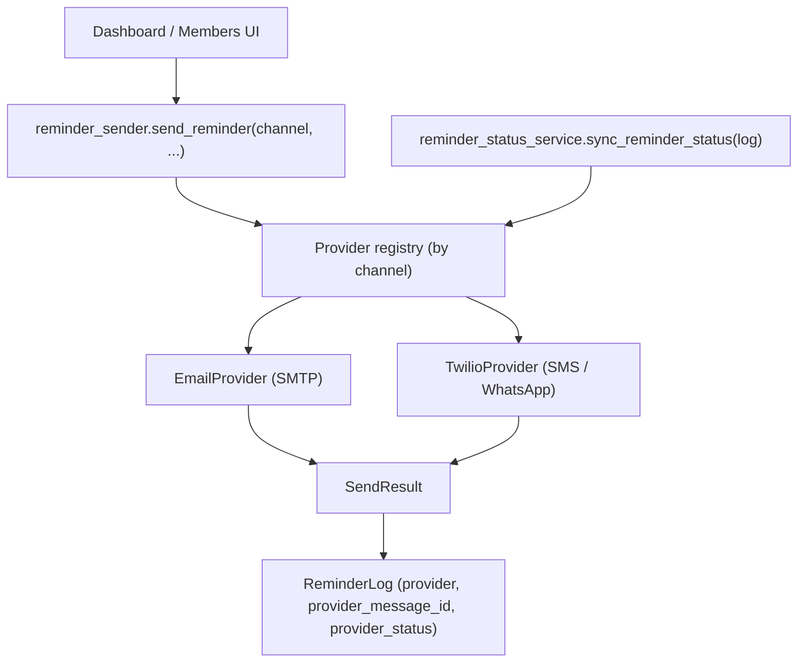

# Notifications Strategy

## Problem

Twilio rejected the application for SMS/WhatsApp sending, so that channel is unusable for now. The app needs to:

1. Keep working (Email-only) without errors while Twilio is unavailable.
2. Keep the Twilio integration code intact and modular so it can be re-enabled later, or swapped for a different provider, without a rewrite.

## Current state

- [`app/services/reminder_sender.py`](../../../app/services/reminder_sender.py) already has a shared `SendResult` dataclass and a single `send_reminder()` entry point - a good foundation.
- [`app/services/twilio_service.py`](../../../app/services/twilio_service.py) is lazily imported inline inside `send_reminder()` (`if channel in {"SMS", "WHATSAPP"}: from app.services.twilio_service import ...`).
- [`app/ui/screens.py`](../../../app/ui/screens.py) imports `fetch_message_status` directly from `twilio_service` to poll delivery status in the Reminders tab - this is UI code reaching directly into a specific provider's implementation.
- `ReminderLog.provider` is already a generic string column (`"SMTP"` | `"TWILIO"`), so the data model doesn't need to change.

## Decision

- **Default to Email only** for now - no new provider (Telegram, Pushover, etc.) is being built in this round, since Email already works and covers the immediate need.
- **Formalize the seam** between "a reminder needs to go out on channel X" and "how channel X actually sends it," so that:
  - Twilio's code isn't touched/deleted - it stays fully functional, just decoupled.
  - Re-enabling Twilio later (or adding Telegram/Pushover/a different SMS API) is "add one provider class + one registry entry," not a UI or business-logic change.
  - The UI degrades gracefully: if Twilio isn't configured, SMS/WhatsApp options simply don't appear, instead of the app erroring out when someone tries to use them.

## Design

- `app/services/notifications/base.py` - a small `NotificationProvider` protocol: `send(...) -> SendResult` and `fetch_status(message_id) -> SendResult | None`.
- `app/services/notifications/email_provider.py` and `twilio_provider.py` - thin adapters around the existing `email_service.py` / `twilio_service.py` logic, conforming to the protocol.
- `reminder_sender.py` picks a provider from a registry keyed by channel, instead of an inline conditional import.
- A new `sync_reminder_status(log)` helper replaces the direct `fetch_message_status` import in `screens.py`, dispatching by `ReminderLog.provider` through the registry.
- `TWILIO_CONFIGURED` config flag added; when false, SMS/WhatsApp options are hidden from the Dashboard "send reminders" controls and from member communication-preference toggles.

## Why this is being tackled early

This is a deliberately small, low-risk refactor placed right after the discussion write-up: it decouples a piece of the codebase before the bigger, riskier schema and accuracy work happens, and it directly unblocks day-to-day usability (no more Twilio config errors breaking reminder sends). Per the owner's request, this phase should be **tested manually before moving on** to the multi-plan schema work.

## Status

Implemented in this round. Twilio SDK/config/tests are untouched and fully reusable later.
