# LLM Bill Import Accuracy

## Problem

The bill import pipeline is a two-step process:

1. Convert the uploaded PDF to text ([`app/services/pdf_extract.py`](../../../app/services/pdf_extract.py) via `pypdf`, then trimmed by [`app/services/bill_text_filter.py`](../../../app/services/bill_text_filter.py))
2. Send a filtered slice of that text plus heuristics as context to an LLM ([`app/services/llm_invoice_extract.py`](../../../app/services/llm_invoice_extract.py), OpenRouter, `gpt-4o-mini`, temperature 0) which proposes a bill total, per-line charges, and a suggested per-phone allocation.

Allocations coming out of this pipeline aren't always correct. There is currently:

- No persistence of the source PDF (`Invoice.pdf_path` is never actually set, despite the column existing)
- No golden/reference dataset of "known correct" bills to test against
- No evaluation harness - accuracy is currently judged by eyeballing each import
- A likely root cause candidate: the raw PDF-to-text conversion is noisy/lossy (multi-column layouts, tables collapsing into run-on lines), which may be feeding the LLM messier context than necessary before it ever gets to reasoning about allocations

## Decision

Treat this as a data problem, not just a prompting problem:

1. **Persist everything** - every uploaded PDF and its final approved allocation becomes part of a growing, versioned dataset instead of being thrown away after import.
2. **Build a real evaluation harness** - before tweaking prompts or models, establish a baseline accuracy score using bills that are already known to be correct (the owner has a set of verified past T-Mobile bills + correct allocations locally), then measure every change against that baseline.
3. **Treat PDF-text cleaning as a first-class step**, not an afterthought - the current suspicion is that a meaningful share of the accuracy problem comes from the LLM receiving poorly structured/cleaned text rather than the model reasoning incorrectly.
4. **Consider a knowledge-base / retrieval approach** as the dataset grows - chunking historical bill text and storing it (with a defined retention period) so that future imports can be checked against patterns from past bills of the same household/plan, rather than each import being a cold, context-free extraction. This may take the form of a small vector store (e.g. embeddings over past bill chunks + allocation outcomes) if plain heuristics and prompt improvements aren't enough on their own - to be evaluated empirically via the harness rather than assumed upfront.

## Planned building blocks

```mermaid
flowchart LR
    PDF["Uploaded bill PDF"] --> Store["Persisted PDF store (data/bills/, later Cloud Storage w/ retention policy)"]
    Store --> Clean["Improved PDF -> text cleaning"]
    Clean --> Chunk["Chunking (optional, for KB/vector store)"]
    Chunk --> VectorDB["Vector DB (candidate, evaluated empirically)"]
    Clean --> LLM["LLM extraction (OpenRouter)"]
    VectorDB -.->|"retrieved context, if it helps"| LLM
    LLM --> Proposal["Bill proposal (lines, totals, allocation suggestion)"]
    Proposal --> Approve["Owner review & approve in UI"]
    Approve --> DB["Invoice / Allocation tables"]
    Approve --> Golden["Golden dataset entry (bill.pdf + expected.json)"]
    Golden --> Eval["eval/run_eval.py"]
    Eval --> History["eval/history.jsonl (accuracy over time)"]
```

Concrete pieces:

- **PDF persistence**: store uploaded PDFs (initially under `data/bills/`, later a Cloud Storage bucket with a defined retention period once volume grows) and actually set `Invoice.pdf_path` on approval.
- **Golden dataset**: `eval/golden/{year}_{month}/bill.pdf` + `expected.json` (expected total, per-member allocations), seeded from the owner's already-verified past bills.
- **Evaluation harness** (`eval/run_eval.py`): replays the full pipeline against every golden case and scores total-amount accuracy, per-member allocation error ($ and %), month/year correctness, and JSON-parse robustness; results are appended to `eval/history.jsonl` so accuracy trends are visible over time and regressions are caught before they reach production.
- **Text cleaning improvements**: revisit `bill_text_filter.py` and the PDF extraction step specifically for structural fidelity (tables, per-line charge blocks) rather than only length-trimming, since this is suspected to be a major accuracy lever.
- **Vector DB / knowledge base**: an optional, empirically-justified next step - chunk historical bill text and allocation outcomes into a small vector store to give the LLM relevant precedent (e.g. "last month this same phone number was allocated to member X") rather than treating every bill as a cold start. This is explicitly a "try it and measure with the eval harness" item, not a guaranteed adoption.
- **Prompting improvements**: structured output/JSON-schema mode to eliminate parse failures, few-shot examples drawn from the golden dataset, and surfacing the LLM's existing `confidence` field more prominently in the UI for manual review of low-confidence imports.

## Status

Scheduled after the multi-plan schema work in this round, since the golden dataset and evaluation harness are most useful once the schema (and therefore what "correct" allocation structure looks like across plans) is stable. The owner will provide the initial batch of verified PDF bills to seed the golden dataset.
