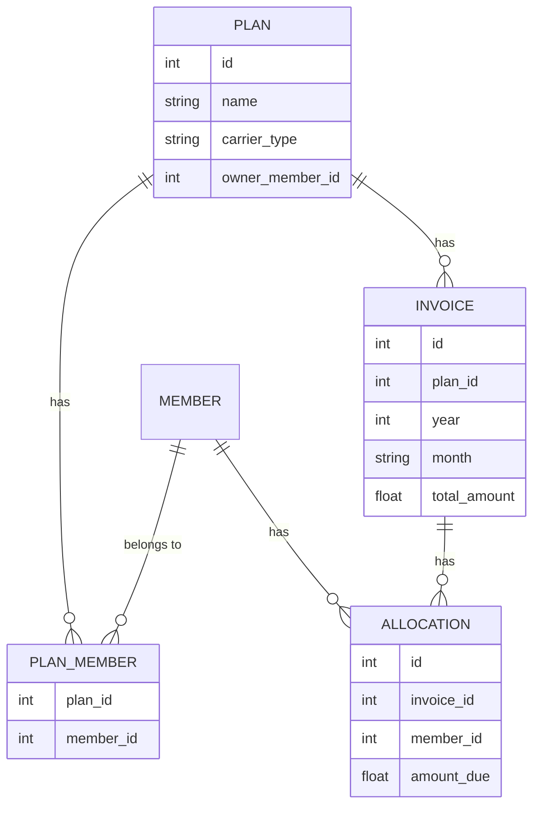

# Multi-Plan Schema Scaling

## Problem

The app currently models a single implicit household plan:

- `Invoice` has `UniqueConstraint("year", "month")` - only one invoice can exist per calendar month, globally, across the entire database.
- The "owner" is identified by a hardcoded name (`OWNER_NAME = "Justine"`) in [`app/services/accounting.py`](../../../app/services/accounting.py) and [`app/services/recompute_owner.py`](../../../app/services/recompute_owner.py), not by any structured relationship.
- There is no `Plan`/`Group`/`Carrier` concept at all - members, invoices, and allocations are all implicitly scoped to "the one plan."
- The seed tooling ([`seed/seed_excel.py`](../../../seed/seed_excel.py), [`seed/cleanup_tmobile_excel.py`](../../../seed/cleanup_tmobile_excel.py)) hardcodes a specific household's member list.

The owner wants to track a **different plan with different members** (e.g. a second mobile plan, or a different kind of shared bill entirely) and be able to see combined spending analytics across all plans, without disrupting the existing production data (current members, invoices, allocations, and payment history must remain intact and correct).

## Decision

Introduce a `Plan` entity and scope invoices (and analytics) to it, via a purely **additive** Alembic migration - no destructive schema changes, no data loss risk to the existing single-plan dataset.

### Target schema

- `plans` table: `id`, `name`, `carrier_type` (drives which LLM prompt/text-filter anchors to use per carrier, e.g. T-Mobile vs. a different provider), `owner_member_id`.
- `plan_members` join table: a person can belong to multiple plans (e.g. the owner is a member of both plans), and each plan has its own roster - this matches "a different plan with different members."
- `invoices.plan_id` FK; the unique constraint moves from `(year, month)` to `(plan_id, year, month)`, so two plans can each have their own invoice for the same month.
- `OWNER_NAME = "Justine"` string-matching is replaced by `Plan.owner_member_id`, a real foreign key.

### Non-disruptive migration strategy

1. Create `plans` and `plan_members` tables (additive - no impact on existing tables).
2. Data migration: insert one default `Plan` row representing everything that exists today (e.g. "T-Mobile Family Plan"); backfill `plan_members` with every current member.
3. Add a nullable `invoices.plan_id`; backfill every existing invoice row to the default plan's id; only then flip the column to `NOT NULL` and swap the unique constraint to `(plan_id, year, month)`.
4. Update all read/write paths (`app/services/crud.py`, `app/services/accounting.py`, `app/services/recompute_owner.py`, bill import, all of `app/ui/screens.py`) to be plan-scoped.
5. Add a plan selector to the UI, defaulting to the single existing plan - so nothing visibly changes for the owner until a second plan is actually created.
6. **Update seed tooling**: `seed/seed_excel.py` and `seed/cleanup_tmobile_excel.py` need to accept/assume a target plan (defaulting to the migrated default plan) so historical re-seeding still works and any future household's seed data can be imported into a specific plan rather than being hardcoded to one household.
7. **Safety net**: take a manual SQLite file copy before running the migration on the production VM, and verify row counts match before/after as part of the deploy process.

### Analytics payoff

Once plans exist, add a cross-plan analytics view (extending the Dashboard or a new tab) showing total spend across all plans, a per-plan breakdown, and trend over time - this is the "overall calculation of my spendings" use case the owner described.

## Status

**Implemented and verified (2026-07-04).**

- Migration `alembic/versions/n5_multi_plan_support.py` is additive: creates `plans`/`plan_members`, backfills a "Default Plan" from all pre-existing data, and swaps the invoice uniqueness constraint - tested against a real backup copy of the dev database (row counts and balances matched exactly before/after) and against a from-scratch install.
- `app/services/crud.py`, `accounting.py`, `recompute_owner.py`, and `payment_apply.py` all accept an optional `plan_id` - defaulting to `None` (the original all-plan/single-plan behavior) so nothing already in production changed behavior. Verified member balances/plan totals are byte-for-byte identical to the pre-migration code path.
- New `app/services/plans.py` service module + a new **Plans** tab (owner-only) in the Gradio UI: create plans, set an owner, add/remove members, and see a cross-plan "All plans (combined)" analytics table (`accounting.all_plans_totals`).
- The **Invoices & Allocations** tab and **Bill Import (LLM)** tab both gained a Plan selector so new invoices/allocations land in the right plan; the Dashboard/Payments/Reminders/Applications tabs intentionally still operate on the all-plan aggregate view (`plan_id=None`) for this first pass - deepening plan-scoping there is a natural follow-up once a second real plan is in daily use.
- `seed/seed_excel.py` now takes an optional `plan_name` argument, resolving/creating that plan and associating every imported member via `plan_members`.
- Known limitation (resolved in the next phase): the "All plans (combined)" analytics row assumed the same owner name across plans, and couldn't attribute outbound bill payments that aren't linked to a specific invoice to one plan.

**Superseded by:** [Multi-Plan Authorization & Global Plan Selector](06-multi-plan-authorization-and-global-selector.md), which added `Payment.plan_id`, authorization (`can_manage_plan`/`can_view_plan`), a global plan selector, and full plan-scoping for Dashboard/Payments/Reminders/Applications.
