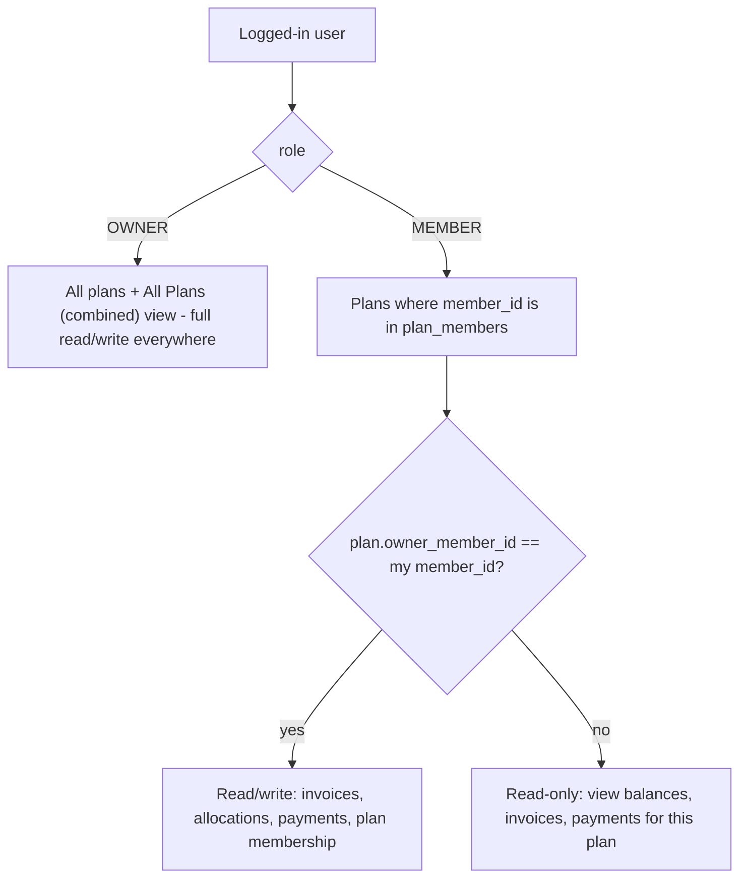

# Multi-Plan Authorization & Global Plan Selector

## Problem

Phase 4 introduced the `Plan`/`PlanMember` schema and let invoices/allocations belong to a specific plan, but left two gaps:

- **No authorization model.** The Plans tab was hidden from `MEMBER` users entirely (owner-only), and every other tab (Invoices, Bill Import, Payments, Applications, Dashboard, Reminders) still operated on the all-plan aggregate (`plan_id=None`) - there was no way for a member to create their own plan, invite people to it, and manage it independently.
- **No consistent way to pick "which plan am I looking at."** Phase 4 bolted a local plan dropdown onto the Invoices and Bill Import tabs only; Payments, Applications, Dashboard, and Reminders had no plan concept in the UI at all, and `Payment` itself had no `plan_id` column - a payment's plan was only inferable (unreliably) through its linked invoice.

The owner wants: only `MEMBER` users create/manage plans (the `OWNER` login stays a cross-plan admin), a single global "Active plan" dropdown that scopes the entire app at once, and payments/applications to keep working correctly once everything is plan-scoped.

## Decisions

1. **Write access to a plan** = only that plan's designated owner (`Plan.owner_member_id`). Other members of the same plan can view its data but not create/edit invoices, allocations, payments, or membership. The `OWNER` app-admin login always has full read/write access everywhere, plus a synthetic **"All Plans (combined)"** choice for the aggregate view (cross-plan analytics itself stays deferred, per the Phase 4 decision - the plumbing just doesn't need rework later).
2. **Payment plan attribution**: added a new, always-populated `Payment.plan_id` column (migration `n6`, additive + backfilled) instead of inferring a payment's plan through its optional `invoice_id`. This makes outbound (unlinked) payments attributable to a plan too, and lets every payment/application query filter by `Payment.plan_id` directly rather than joining through invoices.

## What was built

### 1. Schema: `Payment.plan_id`

- Migration `alembic/versions/n6_payment_plan_id.py`: adds nullable `payments.plan_id`, backfills via (a) the linked invoice's plan, else (b) the payer's single plan membership, else (c) the "Default Plan", then flips the column to `NOT NULL`.
- `app/services/crud.py`'s `add_payment` now requires `plan_id`; `update_payment` accepts it optionally.

### 2. Centralized authorization (`app/services/authz.py`)

- `can_manage_plan(db, role, member_id, plan_id)` - `True` for `OWNER`, or a `MEMBER` who owns that plan.
- `can_view_plan(db, role, member_id, plan_id)` - `can_manage_plan` plus any member belonging to the plan.
- `accessible_plan_choices` / `parse_plan_choice` / `is_all_plans_choice` / `default_plan_choice` - build and parse the dropdown's choice list per role (OWNER gets every plan + "All Plans (combined)"; MEMBER gets only their own plans, labeled `(you manage)` vs `(view only)`).
- Every write path (invoices, allocations, payments, plan membership, reminders) calls `can_manage_plan` server-side before mutating - not just hiding buttons in the UI.

### 3. Global "Active plan" selector

- `app/main.py` holds a `current_plan_id = gr.State(None)` plus a persistent `gr.Dropdown("Active plan")` above the tabs, visible to both roles, refreshed on login/logout/demo-load and whenever role/member changes.
- `current_plan_id` is threaded into every `ui_*` function (`ui_dashboard`, `ui_invoices`, `ui_payments`, `ui_applications`, `ui_reminders`, `ui_bill_import`, `ui_plans`) the same way `current_role`/`current_member_id` already were.
- Creating a plan or changing plan membership refreshes the dropdown immediately.

### 4. Per-tab scoping

- **Plans tab**: opened to `MEMBER` (previously owner-only); a member can always create a new plan (becomes its owner); add/remove-member and set-owner actions are gated by `can_manage_plan`.
- **Invoices & Bill Import**: local per-tab plan dropdowns removed in favor of the global selector; both now open to `MEMBER` and gate creation/editing on `can_manage_plan`.
- **Payments & Applications**: ledger, record/edit/delete, and reconcile all filter by `current_plan_id`; `app/services/payment_apply.py` was simplified to read `payment.plan_id` directly (it always exists now) instead of the optional param threaded through in Phase 4.
- **Dashboard & Reminder Logs**: balances, totals, the Plotly chart, and the "Send reminders" panel all scope to `current_plan_id`; `OWNER`'s "All Plans (combined)" choice reproduces the exact pre-Phase-5 aggregate view. Reminder-sending permission follows `can_manage_plan` for the active plan rather than a blanket `role == OWNER` check.

### 5. Bug found and fixed during verification

`accounting.plan_totals`'s `owner_total_outbound` was still scoping outbound payments by joining through `Invoice.plan_id` (a Phase-4 approximation, since `Payment.plan_id` didn't exist yet). Now that every payment has its own `plan_id`, this was simplified to filter directly on `Payment.plan_id`, which also fixes outbound payments that aren't linked to any invoice (they were invisible to any single-plan total before this fix).

## Verification

Repeated the Phase 4 methodology:

- Backed up the dev database, confirmed migration `n6` backfilled all 63 existing payments to the "Default Plan" with zero `NULL`s.
- Checked out the pre-Phase-4 code (`git worktree`) against the original pre-`n5` database backup and compared `member_balances` / `plan_totals` output to the current code running against the "Default Plan" (`plan_id=1`) - **byte-for-byte identical** after the `owner_total_outbound` fix above.
- Ran `reconcile_all_members_fifo` on isolated copies of both the old and new databases - identical inbound totals, applied totals, and per-member application row counts for every member.
- Created a second real test plan ("AMAZON PRIME MEMBERSHIP", owned by a different member) during manual testing; confirmed on a scratch copy of the database that recording and auto-applying a payment against that plan's invoice left the "Default Plan"'s balances completely untouched, and that `authz.can_manage_plan`/`can_view_plan` correctly distinguish the plan's owner (full access), a regular member of that plan (view-only), and a member with no relationship to the plan (no access) - for both `MEMBER` and `OWNER` roles.
- All scratch/test databases and the temporary git worktree were deleted afterward; the real `tmobile.db` was never written to during verification (checksums confirmed identical before/after).

## Status

**Implemented and verified (2026-07-04).**
