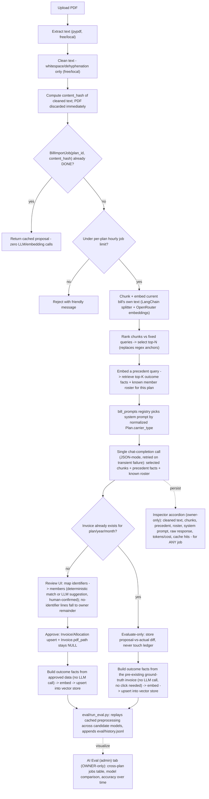

# LLM Bill Import v2: Additive, Cost-Conscious RAG Pipeline

This extends [03-llm-bill-import-accuracy.md](03-llm-bill-import-accuracy.md) rather than superseding it - the legacy synchronous pipeline described there (`app/services/llm_invoice_extract.py`, `app/services/bill_text_filter.py`, the existing Bill Import tab flow) is **unchanged and remains the default**. This document describes the new, opt-in "Try new AI extraction (beta)" pipeline built alongside it.

## Why a new pipeline instead of patching the old one

The legacy pipeline has four structural limitations that are hard to fix incrementally:

1. **Fully synchronous** - upload blocks the Gradio request thread through PDF extraction *and* the LLM call before the review UI appears.
2. **Nothing is persisted** - no PDF, no raw LLM response, no cleaned text - so there's no way to replay an import, build a golden dataset, or run an evaluation harness against real history.
3. **T-Mobile-shaped by construction** - the prompt hardcodes phone-line semantics (`phone_key`), even though `Plan.carrier_type` already exists in the schema (Phase 4) and is unused.
4. **Phone-number-only member matching** - `Member.phone_last4` is the only identifier the legacy "save mapping" feature understands, which breaks down for any bill that identifies people by email, name, or account holder instead.

Rather than risk destabilizing the working legacy path, everything new lives in new files/new sibling functions, wired in via a single opt-in checkbox, unchecked by default.

## Architecture

## Key decisions

1. **Purely additive.** `bill_text_filter.py`, `llm_invoice_extract.py`, and the legacy synchronous UI flow (`_add_mapping`/`_save_mapping_to_db`/`_approve_upsert`/`phone_pick`) are untouched and remain the default. Everything new is opt-in via a "Try new AI extraction (beta)" checkbox in the existing Bill Import tab.
2. **No PDF persistence, ever.** Upload -> extract -> clean -> discard the PDF. Only the cleaned text (a few KB) is stored, keyed by a content hash.
3. **Content-hash caching eliminates repeat cost.** Re-uploading the same bill (intentionally, or during a historical backfill/eval session) short-circuits to the cached `DONE` result - zero new LLM/embedding calls.
4. **The vector store does two jobs, neither adds a chat-completion call:**
   - **Current-bill chunk selection** - chunk + embed the bill's own text, rank against fixed queries (e.g. "total amount due and per-line bill summary"), send the LLM only the top-N chunks. Replaces the regex-anchor search and generalizes across carriers.
   - **Historical precedent** - a compact "outcome fact" (e.g. `"Vinay: $56.79 in Oct 2026"`) is built with plain string formatting from already-approved `Invoice`/`Allocation` rows - no extra LLM call - then embedded and stored per plan, tagged with `member_id` in its metadata. Retrieval is a **deterministic metadata-filtered lookup** (each known member's most recent 1-2 facts), not a semantic search - see "Accuracy investigation" below for why semantic similarity was dropped for this specific fact type.
   - Embeddings go through OpenRouter's `/embeddings` endpoint, reusing the existing `OPENROUTER_API_KEY`. Chroma is configured with **precomputed** embeddings so its bundled `onnxruntime`-based default embedder is never invoked.
5. **Carrier-agnostic prompting.** `app/services/bill_prompts/registry.py` picks a system prompt from a normalized `Plan.carrier_type` (lowercased, punctuation-stripped) - the T-Mobile prompt when it matches or is unset, a generic prompt otherwise.
6. **Evaluate-only mode.** If a bill's `(plan_id, year, month)` already has an approved `Invoice`, the pipeline runs extraction, diffs the proposal against the existing record, and stores that comparison - **never writing to the ledger**. This means uploading an archive of old bills through the normal UI *is* the backfill/golden-dataset process, with zero risk to existing data. **Fix (post-launch):** the first version of this only diffed and never actually seeded the vector store from the ground-truth `Invoice` - `bill_import_worker._run_job`'s `EVALUATE_ONLY` branch now also calls `vectorstore.build_outcome_facts_for_invoice` + `upsert_outcome_facts` using the pre-existing, already-approved invoice (not the LLM's proposal), so backfilling old bills genuinely populates precedent without any manual approval click.
7. **Queue-based processing.** A SQLite-backed `bill_import_jobs` table + a single in-process background daemon thread (no Redis/Celery) - one job at a time, a deliberate fit for the target `e2-micro` VM.
8. **A rate-limit backstop** on top of content-hash caching (`BILL_IMPORT_MAX_JOBS_PER_HOUR_PER_PLAN`) guards against a runaway bug/loop; content-hash caching already makes exact repeats free.
9. **Eval harness cost stays flat as history grows.** Preprocessing (chunks, precedent) is cached per job and reused across every model comparison; only the LLM call itself is repeated per `(job, model)` pair, and already-scored pairs are skipped unless `--force`.
10. **Generalized member identifiers.** A new `member_identifiers` table generalizes `Member.phone_last4` to phone/email/name/account. Deterministic matching (`match_member()`) is exact/normalized only - never fuzzy - to avoid silently cross-matching two people. A line with no identifiable person (`identifier.type == "none"`) isn't bucketed at all - it's excluded from the mapping step and falls into the existing owner-remainder mechanism, matching how this app is actually used (one owner, tracking their own plan).
11. **LLM suggestions, never auto-writes.** The plan's known-member roster (from `member_identifiers`) is given to the LLM as a suggestion input; it may propose `matched_member_id` per line using its own fuzzy-matching strength. The deterministic lookup always wins if it finds anything; the LLM's guess only pre-fills the mapping dropdown for unresolved lines, still requiring human confirmation before anything is saved.
12. **Two accuracy/reliability upgrades:** (a) JSON-object ("structured output") mode on the chat-completion call, falling back to prompt-based parsing if the routed model doesn't support it; (b) the worker retries a transient LLM/embedding failure with backoff before marking a job `FAILED`.
13. **Operational resilience.** On worker startup, any job stuck in `PROCESSING` (e.g. a VM restart mid-job) resets to `PENDING`. `scripts/rebuild_vectorstore.py` regenerates the entire vector store from already-approved `Invoice`/`Allocation` data at any time (VM move, disk wipe, embedding-model change) at embedding-only cost. `data/vectorstore/` is gitignored - it's a regenerable index, not a source of truth.
14. **Full observability, not just the happy path.** Every job (any status, any mode - including evaluate-only) persists the exact `system_prompt` used, the `known_roster` snapshot sent, and a `token_usage` breakdown (chat + embedding prompt/completion tokens and real `$` cost, pulled straight from OpenRouter's `extra_body={"usage": {"include": true}}` accounting - no hand-maintained pricing table). A `cache_hit_count` tracks how many times an identical re-upload short-circuited to a job's cached result. An owner-only **"Inspect a job"** accordion in the Bill Import tab surfaces all of this for any job, and a separate, owner-only **"AI Eval (admin)"** tab visualizes it across every plan alongside `eval/history.jsonl`.

## Schema changes (all additive)

- **`bill_import_jobs`** (migration `n8`) - the audit trail/golden dataset for the v2 pipeline: `content_hash` (unique per plan, powers the cache), `cleaned_text`, `selected_chunks_json`, `precedent_used_json`, `llm_raw_response`, `proposal_json`, `status` (`PENDING`/`PROCESSING`/`DONE`/`FAILED`), `mode` (`NORMAL`/`EVALUATE_ONLY`), `invoice_id` (linked once a proposal is approved, or automatically in evaluate-only mode - this is what lets the eval harness score both kinds of jobs), `diff_json`.
- **`member_identifiers`** (migration `n9`) - generalizes `Member.phone_last4` (untouched) to `PHONE_LAST4`/`EMAIL`/`NAME`/`ACCOUNT`, each row optionally plan-scoped. Migration `n9` backfills one `PHONE_LAST4` row per existing `Member.phone_last4` so nothing has to be re-entered.
- **`bill_import_jobs` observability columns** (migration `n10`, additive) - `system_prompt` (Text), `known_roster_json` (Text), `token_usage_json` (Text - `{chat_prompt_tokens, chat_completion_tokens, chat_total_tokens, chat_cost_usd, embedding_tokens, embedding_cost_usd}`), `cache_hit_count` (Integer, default `0`).

## New modules

| Module | Purpose |
| --- | --- |
| `app/services/embeddings_client.py` | OpenRouter `/embeddings` wrapper, plus a LangChain `Embeddings` adapter used by Chroma. Accepts an optional `usage_sink` dict to accumulate embedding token/cost usage across calls. |
| `app/services/bill_preprocess.py` | `clean_text`/`content_hash`/`chunk_text` - cheap, local, carrier-agnostic. |
| `app/services/bill_prompts/` | `tmobile.py`, `generic.py`, `registry.py`, `schema.py` - carrier-aware system prompts + shared output schema. |
| `app/services/vectorstore.py` | Chroma-backed chunk selection, outcome-fact upsert/retrieval, `build_outcome_facts_for_invoice`. `select_relevant_chunks`/`retrieve_precedent` accept an optional `usage_sink`. |
| `app/services/member_identifiers.py` | `match_member` (deterministic), `save_identifier`, `build_known_roster`, `apply_deterministic_matches`, `dedupe_llm_suggestions` (round 4). |
| `app/services/allocation_view.py` | (round 4) `build_member_allocation_view` - the single shared per-member allocation builder used by the NORMAL-mode review UI, the evaluate-only diff, and `eval/run_eval.py`. |
| `app/services/llm_invoice_extract_v2.py` | The v2 extractor - carrier prompt + selected chunks + precedent + roster -> `BillProposalV2` (now also carrying `system_prompt` and `token_usage`). |
| `app/services/bill_import_worker.py` | `enqueue_job`/`get_job`/`list_recent_jobs` + the background daemon thread (started from `app/main.py`). Persists observability fields per job and increments `cache_hit_count` on cache hits. |
| `scripts/rebuild_vectorstore.py` | Regenerate the vector store from the DB at any time. |
| `eval/run_eval.py` | Cost-flat evaluation harness across candidate models, appends to `eval/history.jsonl`. |
| `app/services/eval_dashboard.py` | Read-only aggregation for the admin dashboard: `list_all_jobs` (cross-plan), `load_eval_history`, `aggregate_by_model`. |
| `app/ui/eval_dashboard.py` | The "AI Eval (admin)" tab UI - jobs table, model-comparison table/chart, accuracy-over-time chart. |

## Config additions (`app/core/config.py`)

`OPENROUTER_EMBEDDING_MODEL` (default `openai/text-embedding-3-small`), `VECTOR_RETRIEVAL_LOOKBACK_MONTHS` (default `24`), `BILL_IMPORT_MAX_JOBS_PER_HOUR_PER_PLAN` (default `10`), `BILL_TEXT_RETENTION_DAYS` (default `0` = keep forever - it's a few KB, not a PDF).

## UI

A single "🧪 Try new AI extraction (beta)" checkbox in the Bill Import tab reveals an entirely parallel section: upload -> enqueue -> poll (via `gr.Timer`, same pattern as Reminder Logs) -> either an evaluate-only comparison view (read-only, no ledger writes possible) or a review table + "map identifier -> member" step (pre-filled from deterministic/LLM-suggested matches) -> approve. A "Recent AI imports" table (scoped to the active plan) makes jobs submitted in an earlier session discoverable.

Two more pieces, both gated to plan owner + app `OWNER` (`authz.can_manage_plan`):

- **"🔎 Inspect a job" accordion** (inside the beta section, scoped to the active plan) - pick any job (any status/mode, including evaluate-only) from a dropdown and see its cleaned text, the exact chunks selected/sent, historical precedent used, the known-roster snapshot, the exact system prompt, the raw LLM response, the fully parsed proposal (including unmatched `identifier.type == "none"` lines), the evaluate-only diff if applicable, and token/cost/cache-hit numbers. Purely read-only - it never triggers a ledger write, so it's safe to open regardless of job status.
- **"AI Eval (admin)" tab** (new top-level tab, `apply_role_visibility`-gated to `OWNER` only since it spans every plan) - a jobs table across all plans, a model-comparison table + grouped bar chart (mean per-member $ error, JSON-parse success rate, month/year match rate) and an accuracy-over-time line chart, both sourced from `eval/history.jsonl`. Running new evals stays a CLI action (`uv run python eval/run_eval.py`) in this version - no in-UI trigger, to keep LLM spend an explicit, deliberate action.

## How this reaches production

Same mechanism as `n5`-`n7`: back up `tmobile.db`, then `python create_db.py` applies `n8`/`n9`/`n10`. New dependencies (`langchain-core`, `langchain-text-splitters`, `langchain-chroma`, `langchain-openai`, `chromadb`) need `uv sync` on the VM - no new API credential, embeddings reuse `OPENROUTER_API_KEY`. The only new on-disk data is `data/vectorstore/`, which is regenerable and doesn't strictly need to be backed up.

## Status

**Implemented and smoke-tested end-to-end** against the live dev database and real OpenRouter chat-completion/embedding calls: content-hash dedup, per-plan rate limiting, deterministic + LLM-suggested identifier matching (tested against both a T-Mobile-style phone bill and a generic email/name-based bill), evaluate-only diffing against a real historical invoice (confirmed the ledger is untouched and, post-fix, that outcome facts are seeded automatically), `scripts/rebuild_vectorstore.py` against the full existing dataset (26 invoices), `eval/run_eval.py`'s scoring + skip-already-scored behavior, real OpenRouter usage/cost accounting on both chat and embedding calls, the "Inspect a job" accordion, and the "AI Eval (admin)" dashboard (verified against real jobs + a populated `eval/history.jsonl`).

**Round 4 (this pass):** `member_identifiers.dedupe_llm_suggestions`, `allocation_view.build_member_allocation_view`, the new sectioned review UI, and `_v2_approve`'s member-keyed rewrite were verified with backend integration tests against the real dev DB/roster (mocked LLM output only, to avoid unnecessary OpenRouter spend on every code iteration) - confirmed: (a) the exact reported double-guess repro (`phone:6488` + `phone:4478` both proposing member 7) resolves to one deterministic match and one cleared-to-unmatched line; (b) a member with two real matched lines writes as a single summed `Allocation` row, not an overwrite; (c) the full per-member allocation reconciles exactly to the bill's `total_amount` via proportional history distribution; (d) approve writes land correctly and re-sum on inspection. `bill_import_jobs` and `eval/history.jsonl` were wiped again afterward (and any Invoice/Allocation/vector-store rows created incidentally by these tests were deleted) so the next real upload through the UI starts from a clean slate. Next real-world step is for the owner to exercise the "beta" toggle from the UI against their own archive of PDFs using the refreshed checklist in [09-bill-import-v2-manual-test-plan.md](09-bill-import-v2-manual-test-plan.md).

## Accuracy investigation and fixes (first real-world evaluate-only test)

The Inspector immediately paid for itself: the first real evaluate-only upload (a genuine T-Mobile April 2024 bill) showed a diff that looked like the model was predicting ~$0 for most members, and precedent that only ever showed one member's history ("Roshan") no matter the plan. Root-causing with the raw job data (not guesses) found **three distinct issues**, all fixed:

1. **The LLM silently dropped the shared "Account" charge.** The prompt already instructs the model to emit account-level charges as an `identifier.type == "none"` line, but on this bill the model just omitted the $120 line entirely from `lines` - `total_amount` still came out correct, but the per-line breakdown didn't sum to it, so $120 vanished before allocation ever ran. **Fix:** `llm_invoice_extract_v2.py` now compares `sum(line_totals)` against `total_amount` after parsing and, if they don't reconcile (in either direction), synthesizes a `"synthesized_residual"` `none`-type line for the shortfall (or appends a warning note if lines *exceed* the total) - a pure post-processing safety net, no extra LLM call.
2. **The evaluate-only diff silently discarded unmatched dollars.** `_diff_against_invoice` only added a line's `line_total` to a member's proposed amount if `matched_member_id` was set; anything unmatched (very common - see #3) just disappeared from every member's comparison, making genuinely-correct extraction look like total failure. **Fix:** unmatched dollars are now tallied separately as `unmatched_total`/`unmatched_lines` and surfaced as an explicit "⚠️ Unmatched" row in both the evaluate-only diff view and the Inspector's diff table, plus recorated in `eval/run_eval.py`'s scoring output for the same reason.
3. **Precedent retrieval was semantically biased, not "truncated."** `retrieve_precedent`'s embedding similarity search over homogeneous `"Name: $amount in Month Year"` strings turned out not to correlate with genuine relevance - verified directly against the vector store that, for the exact same invoice period, one member's fact would consistently score as "more similar" to a generic query than every other member's fact for that same invoice (an embedding-space artifact of the short, templated text, not a real signal). A fixed top-K search could therefore return 8 facts for one member and zero for anyone else, regardless of the actual plan roster. **Fix:** outcome facts now carry `member_id` in their Chroma metadata (`build_outcome_facts_for_invoice`/`upsert_outcome_facts`), and `retrieve_precedent(plan_id, member_ids, periods_per_member=2, ...)` is now a **deterministic metadata-filtered lookup** - each known member's most recent 1-2 outcome facts, guaranteed - rather than a semantic top-K search. Since every outcome fact is built from the plan's own `Invoice`/`Allocation` rows (never bill text), the roster is always known upfront, so there's no scenario where deterministic beats semantic here; it also removes an embedding call per job (small extra cost savings). Required a one-time `scripts/rebuild_vectorstore.py` run after wiping `data/vectorstore/` to backfill `member_id` on all 150 existing facts.

Separately (not a bug, a data-coverage gap surfaced by the same investigation): most members on this plan have **no saved `member_identifiers`** at all (only 2 of 9 had ever been mapped), so even perfect extraction can only auto-match a fraction of lines on any given bill - the LLM's own guesses fill in the rest but always require human confirmation before anything is saved. Since evaluate-only mode is exactly when the ground truth is already known (an approved invoice exists), the mapping tool (identifier -> member -> "Save mapping to DB") is now also available from the evaluate-only diff view, not just the normal new-bill review flow - it only ever writes to `member_identifiers`, never the ledger, so it's safe to use while reviewing historical bills purely to build up identifier coverage over time.

Two more fixes from a follow-up "no context, but future-dated precedent" report: `bill_preprocess.guess_bill_period_key` (regex over the bill's own issue date, e.g. "Apr 19, 2024") now gives `retrieve_precedent` a `before_period_key` so it never surfaces facts from after the bill being processed - previously it fell back to "now," so a 2024 bill imported in 2026 would see 2025/2026 precedent. And, at the user's request, "none"-type (shared/account-level) charges are now split equally across an invoice's actual members **for the evaluate-only comparison and eval-harness scoring only** (`none_total_split` in both `_diff_against_invoice` and `eval/run_eval.py`'s `_score_job`) - the real ledger is unaffected; this only changes what the accuracy report considers a "fair" per-member target.

## Accuracy investigation, round 2 (first re-test after the round-1 fixes)

A second real-world test (same T-Mobile bill, after the round-1 fixes above) surfaced three more issues, all root-caused against the actual job row rather than guessed at:

1. **The eval dashboard showed no accuracy/graphs, and `eval/run_eval.py` errored on the command line.** Two separate causes: (a) `eval/history.jsonl` was legitimately empty because it had just been wiped for a clean retest - not a regression; (b) running `uv run python eval/run_eval.py` directly from the project root failed with `ModuleNotFoundError: No module named 'app'`, because `eval/` isn't a package and nothing added the project root to `sys.path` - not a venv problem. **Fix:** both `eval/run_eval.py` and `scripts/rebuild_vectorstore.py` now insert the project root into `sys.path` themselves at the top of the file, so `uv run python eval/run_eval.py ...` works standalone without also requiring `PYTHONPATH=.`.
2. **A phone number's last 4 digits were extracted wrong** (`(862) 372-0447` came back from the model as identifier value `3727`, not `0447`) - a pure LLM character-counting error (verified: no `member_identifiers` row existed for either value, and the line's own `matched_member_id` was `None`, so this wasn't a mapping bug). LLMs are unreliable at precise digit-indexing tasks like "give me the last 4 digits," but are much more reliable at quoting a line of text verbatim - and the model is already asked to do exactly that (`evidence_total_line`) for every line. **Fix:** `llm_invoice_extract_v2._reconcile_phone_last4` re-derives the last 4 digits from a regex match against the quoted evidence line and prefers that over the model's own digit extraction whenever they disagree - code does the precise extraction, the model just has to find the right line.
3. **The diff table's numbers looked like they didn't reconcile with the bill total.** They actually did (verified against the exact job: `sum(per-member proposed) + unmatched_total == proposed_total`, to the penny) - but neither diff table had a visible total row, so there was no way to check that without doing the arithmetic yourself. **Fix:** an explicit **"Total"** row was added to both the evaluate-only diff table and the Inspector's diff table.

## Precedent-based fallback for members with no identifier match yet (NORMAL mode)

Feature request from the same round of testing: a member with no phone/email/name match anywhere on the *current* bill (either no saved `member_identifiers` row, or this bill just doesn't mention them recognizably) previously got nothing in the review table - their share silently depended on someone remembering to add them manually. Since this plan's outcome-fact history already contains a `member_id`-tagged amount per member per past bill (added in the round-1 precedent fix), that data can pre-fill a starting point instead of leaving a gap.

**Design chosen (auto-fill, always editable):** in `_v2_poll`'s NORMAL-mode branch (`app/ui/bill_import.py`), for every roster member not covered by a real matched line, `vectorstore.get_latest_amount_per_member(plan_id, member_ids, before_period_key=<this bill's own period>, lookback_months=...)` looks up their single most recent outcome-fact amount (a new structured counterpart to `retrieve_precedent` - outcome facts now carry `amount` in Chroma metadata, not just the formatted string, so this doesn't need to regex-parse "Name: $X in Month Year"). Each hit becomes an extra row in the review table, clearly labeled `[from history] <name> - usually $X (Mon Year), not identified on this bill`, `match_source: "precedent_fallback"`, `confidence: 0.3`, pre-mapped via a synthetic `precedent:<member_id>` key (deliberately excluded from the "map identifier -> member -> save to DB" dropdown, since there's no real bill identifier to save here). Because these rows flow through the exact same table + mapping dict as real lines, `_v2_approve`'s existing owner-remainder mechanism (`owner_amt = total - sum(mapped amounts)`) automatically absorbs whatever's left over - no changes needed to the approval path itself. The owner reviews, edits, or deletes any of these rows before approving, same as any LLM-suggested row; nothing here is ever auto-written.

This intentionally does **not** touch evaluate-only diffing/scoring (that path already has ground truth and a real accuracy question to answer) or try to have the LLM itself reason about precedent amounts when unsure (asking a model to reconcile "which extracted-but-unmatched line is probably this specific person, based on them historically paying a similar amount" risks silently misattributing money between multiple similarly-priced members - a materially different, higher-risk kind of guess than "this named/numbered roster member has no line at all, suggest their last known amount as a starting point").

## Accuracy investigation, round 3: a real double-counting bug, a stale-UI class of bugs, and prompt over-guessing

A third pass surfaced one genuine data bug and a family of UI staleness issues, plus confirmed the model needed firmer guardrails:

1. **A real double-counting bug in the Inspector's diff table.** The `none_total_split` dollars were already folded into each member's `proposed_amount` row (their equal share added in), but a previous fix *also* added them again as their own separate table row labeled "'none' charges (already split...)" - visually indistinguishable from an actual extra line item. Naively summing the visible rows therefore came out higher than the real bill total, looking exactly like "the shared charge is being billed on top of everyone else" even though the independently-computed Total row underneath was always correct. **Fix:** removed the row entirely; the split amount is now only mentioned as a note in the summary text, never counted twice.
2. **A family of stale-UI bugs, all from the same underlying pattern: nothing proactively clears old data when new data is coming.** (a) Switching the job dropdown in "Inspect a job" left the previously-inspected job's data on screen until the separate "Inspect" button was clicked again - fixed by wiring the dropdown's `.change()` to also trigger a refresh. (b) Uploading a new bill left the *previous* job's diff/review UI on screen until the first status-poll tick (a few seconds later) finally cleared it - fixed by having the enqueue action itself immediately reset every diff/review display component, not just the status text.
3. **The evaluate-only/review view intermittently not showing at all**, even after serializing the polling Timer's execution order (`concurrency_limit=1`, applied in round 2) - root cause unconfirmed (Gradio `gr.State` doesn't survive a page reload/session hiccup, and there's inherent uncertainty in browser-side timer/event behavior that's hard to fully verify without live browser access). Rather than keep guessing blindly, added two deterministic, timer-independent escape hatches that call the exact same rendering function directly: a **"🔄 Check status now"** button next to the job status box, and an **"⬆️ Load this job into Review & Approve"** button in the Inspector that can reopen *any* `DONE` job's review/approve or evaluate-only screen on demand, regardless of what the live auto-polling view ever showed. Since every job's proposal/diff is fully persisted in `bill_import_jobs` regardless of what got rendered, this guarantees a way back to the approve flow even if the live view never worked for a given session.
4. **The model was guessing the same person twice on one bill with no real evidence** (e.g. matching two different unresolved phone lines to the same roster member) - a genuine prompt-compliance gap, not a code bug. Both `tmobile.py` and `generic.py` were tightened: `matched_member_id` may only be set when the line's own identifier value matches a `known_identifiers` entry (never inferred from "their historical amount looks about right"), and never assigned to the same member twice on one bill without direct textual evidence for both.

## Round 4: the prompt fix didn't hold, a real overwrite bug, a fictional eval metric, and a confusing UI - full rewrite

A fourth round of real testing showed the round-3 prompt tightening (#4 above) did **not** reliably stop the model from double-guessing, on top of a genuine data-write bug and a UI that had accumulated three loosely-connected pieces (an editable per-*line* table, a separate identifier→member picker with no context, a separate read-only mappings table) that were hard to reason about together. Root-caused against a specific job (`phone:4478` and `phone:6488` both ending up mapped to the same member) rather than guessed at:

1. **Bug 1 - prompt-only guardrails aren't reliable enough on their own.** In the reproduced job, `phone:4478` matched member 7 via a real saved identifier (`match_source=deterministic`, correct) - but `phone:6488` *also* matched member 7, this time via `match_source=llm_suggestion`, with zero textual evidence, despite the round-3 prompt rule explicitly forbidding exactly this. **Fix:** a code-level backstop, `member_identifiers.dedupe_llm_suggestions()`, runs after every matching pass (real jobs, evaluate-only diffing, and eval-CLI scoring alike): a `deterministic` match may legitimately "own" a member across multiple lines (e.g. two real phone lines for one person - that's real evidence), but an `llm_suggestion` may not - if it collides with a member already claimed deterministically, or if two lines both guess the same member via suggestion with no deterministic claim, **all** the colliding guesses are cleared back to unmatched rather than the model's guess being trusted. Verified against the exact repro: `phone:6488`'s bogus suggestion is nulled out, `phone:4478`'s real deterministic match is untouched.
2. **Bug 2 - a real overwrite-not-sum bug in the approve write path.** `_v2_approve` iterated proposal *lines* and wrote each mapped `(member_id, amount)` pair with `existing.amount_due = amt` - a plain assignment. If a member legitimately had two mapped lines (two real phone lines, or a line plus a precedent-fallback row), the second write silently **replaced** the first instead of adding to it, independent of Bug 1. **Fix:** see the redesign below - the new review UI has exactly one row per *member*, not per line, so there's structurally no way for a second write to clobber a first one anymore.
3. **Bug 3 - the eval/diff scoring measured a fictional allocation, not what the app actually does.** Both `eval/run_eval.py` and `_diff_against_invoice` split "none"/shared charges **equally across every member** purely for comparison math (a deliberate round-1 decision, see above) - but the real ledger never does that; `_v2_approve` always sent shared/unmatched money to whichever member was picked as "owner absorbs remainder," and `Plan.owner_member_id` already persists a real answer per plan. So the accuracy numbers didn't actually measure "how close would this have been if approved on autopilot" - they measured a synthetic proxy the app never uses. Separately, this same scoring loop in `eval/run_eval.py` skipped the Bug-1 dedupe check entirely, so a double-guessing model could silently inflate one member's score while zeroing another's.
4. **The review/approve and identifier-mapping UI was confusing to edit.** Three loosely-connected pieces (an editable table keyed by raw identifier string, a separate identifier→member dropdown pair with no visual link back to a row, a separate read-only "current mappings" table showing raw member IDs) made it hard to tell "which row am I editing" or "which member does ID 7 even refer to." The `[from history] ...` precedent fallback rows compounded this - they looked like real bill lines but used a synthetic `precedent:<id>` key that couldn't be saved as a real mapping.

### Fix: one allocation view, shared everywhere

A single new module, `app/services/allocation_view.py`, replaces three independent implementations (the `[from history]` pseudo-row hack in the old NORMAL-mode UI, the equal-split in `_diff_against_invoice`, and the equal-split in `eval/run_eval.py`) with one `build_member_allocation_view(db, plan_id, roster, lines, bill_period_key, lookback_months)` used by all three:

- Always re-applies `member_identifiers.apply_deterministic_matches()` + `dedupe_llm_suggestions()` on the lines it's given, mutating them in place - so a mapping saved *after* a job finished (e.g. via the new "Unresolved charges" section below) is picked up on the very next render, and every caller gets the same double-guess guardrail.
- One `MemberAllocation` per **roster member** (not per bill line), each tagged with a `basis`: `from_bill` (sum of this bill's own matched line(s) for them), `from_history` (see below), `owner_absorbs`, or plain "no data."
- **The "unclaimed" pool** - `none`-type shared charges plus any real identifier nobody could be matched to - is distributed **proportionally by history** across every member with no bill line of their own (e.g. if two unmatched members' history is roughly 60/40, they split the pool roughly 60/40), *not* each given their full historical amount stacked on top of the bill's own total. The earlier per-member "give everyone their last known amount" design (used for the round-3 `[from history]` fallback) turned out to silently break reconciliation the moment a plan has more roster members with *some* history than the current bill's unclaimed pool can actually cover - it was adding money that was never part of the bill's total in the first place. Proportional distribution guarantees the sum of every member's amount equals the bill total (to the penny, barring LLM rounding already handled by the residual-line synthesis), which is exactly what the new live reconciliation banner (below) needs to be trustworthy.
- Whatever's left after that (no history signal for anyone unmatched, or a few cents of rounding remainder) falls to `Plan.owner_member_id` - matching what `_v2_approve` already did silently on approval. If a plan has no owner set, that money is left visibly unattributed (`unattributed_total`) rather than guessed at.
- `eval/run_eval.py` and `_diff_against_invoice` (evaluate-only mode) now both call this same function - so the Eval Dashboard's numbers and the evaluate-only comparison both represent "how close would this have been if approved as proposed," not a synthetic proxy.

### Fix: one editable table per person, not per bill-line

The NORMAL-mode review UI (`app/ui/bill_import.py`) is now three clearly-separated sections instead of a table + two separate mapping tools:

- **Section A - "What we found on this bill" (read-only):** every real line the LLM extracted, in plain language - member **name** (not ID), a badge (`🔒 saved mapping` / `🤖 AI guess` / `❓ unresolved`), amount, confidence. Pure reference; nothing here is edited directly.
- **Section B - "Amounts by person" (the only editable table):** one row per current roster member, sourced straight from `build_member_allocation_view` - `member_id` (kept for the approve write, sits right next to the member's name so it's no longer an opaque ID), amount, and a plain-language basis/note column. Uses Gradio's `static_columns` to make only the **Amount** column interactive - member/basis/note render but can't be fat-fingered. This *is* what gets approved: `_v2_approve` now just upserts one `Allocation` per row in this table (`member_id`, `amount`) - no more separate identifier→member "mappings" dict at approval time, and structurally no way for two rows to collide on the same member (Bug 2 fixed by construction, not by patching the old overwrite).
- **Section C - "Unresolved charges" (conditional, shared by both modes):** only rendered when a real bill charge's identifier matched nobody. One row per such charge with an inline member-picker + "Link" button that saves straight to `member_identifiers` and re-polls immediately - the freshly-saved mapping shows up in Sections A/B right away, because `build_member_allocation_view` always re-applies matching fresh.
- **A live reconciliation banner** ("Bill total $327.09 · Assigned $327.09 · ✅ fully reconciled" or a ⚠️ warning naming the remaining gap) sits above Section B, replacing "add it up yourself and hope."
- **Evaluate-only mode** keeps Section A + a per-member actual-vs-proposed diff table (now using the same `basis` labels and real member names), drops the duplicate mapping mini-tool in favor of the shared Section C, and states explicitly that it's **read-only** ("this is a read-only accuracy check... nothing above ever touches your ledger. To correct the real invoice's amounts, edit it directly from Payments → Invoices.") - including in the "Load this job into Review & Approve" status message, since evaluate-only jobs never had anything to approve in the first place.

### Scope decisions carried into this fix (from user discussion)

- Evaluate-only "Load into Review" stays **read-only** by design - there's genuinely nothing to approve since the invoice already exists; only the messaging changed, no new "apply this AI proposal over an existing approved invoice" write path was added.
- Precedent/history is **included by default**, not opt-in, on the theory that most members pay close to the same amount every month - but distributed proportionally (see above) instead of each member's full historical amount being added on top.
- "None"/shared charges and genuinely-unmatched-identifier charges both default to the plan's real owner (matching what approval already did silently) - not a synthetic equal-split, and not a permanently-zero "Unmatched" bucket that never counts toward anyone.

## Round 5: real end-to-end testing - split scope, default flow, double-submit

First real (not synthetic) end-to-end pass through the round-4 rewrite: uploaded a real bill, approved it in NORMAL mode, ran `eval/run_eval.py` against it. Surfaced one more real design flaw plus two pure-UX asks:

1. **The proportional-by-history distribution (round 4, point 2 above) still charged people who simply aren't on this bill.** Concretely: a plan with 8 roster members where a given month's T-Mobile bill only has 5 real phone lines - the other 3 (no line on this account at all, e.g. removed, or tracked in this app for spend-visibility only) ended up with real dollars from the shared "Account" charge, proportional to whatever they'd paid in some *other* month, purely because they had *any* history on file. Confirmed against the real approved invoice: two roster members with no line on the bill received $110.19 and $27.55 respectively from the shared pool, while the 5 people who actually have phone lines on this bill effectively subsidized them. **This is backwards** - a shared charge on a bill belongs to the people on that bill, not to whoever historically happened to exist in the plan.
   **Fix:** `build_member_allocation_view` no longer distributes the unclaimed pool by history at all. It now splits `none_total + unmatched_total` **equally across only the members who matched a real line on *this* bill** (`basis == from_bill`). Members with no line on this bill get `$0` by default - not zero-with-no-explanation, though: their last known amount (if any) is still looked up and surfaced as a `detail` note ("not on this bill (last time: $X, <month>)") so a human can immediately tell "not on this bill" apart from "on this bill for $0," and can always type in a number manually (the live reconciliation banner will flag it as unbalanced until the edited total lines back up, which is the intended guardrail for manual overrides). `owner_absorbs` is now reached only when literally nobody matched a line on the bill, or for the few-cent rounding remainder left over by the equal split - not as the routine "no history" fallback it used to double as.
   This is a real behavior change from round 4's "proportional by history," not just a bug fix - reconciliation was never broken by it (round 4 already fixed that), but the recipient of the money was wrong. `eval/run_eval.py` and the evaluate-only diff needed zero code changes to pick this up, since both already call the shared `build_member_allocation_view` - this is exactly the payoff of round 4's "one allocation view, shared everywhere" fix.
2. **The old manual 5-step flow (Upload & extract → LLM proposal → Review & edit → Map phone→member → Validate & approve) was still the default-visible thing on the page, with the AI-assisted flow behind an opt-in, unchecked-by-default "🧪 Try new AI extraction (beta)" checkbox** - backwards, now that the AI flow is the one actually being used and iterated on. **Fix:** the checkbox now defaults to **checked** (AI-assisted flow visible by default), and the entire legacy 5-step flow + charge explorer is wrapped in a collapsed `"⚙️ Legacy manual bill import (old flow)"` accordion, not removed - still there as a manual fallback, just no longer the first thing anyone sees.
3. **Nothing stopped a double-click on Approve.** Both approve buttons (`_v2_approve`'s "✅ Approve & create invoice" and the legacy `_approve_upsert`'s "Approve & upsert to DB") now flip to a disabled `"⏳ Approving..."` state the instant they're clicked (a Gradio `.click().then().then()` chain: disable → run the real approve function → re-enable), so a second click while the first write is still in flight is structurally impossible rather than just unlikely. `_v2_approve`'s body also got wrapped in a blanket `try/except` returning an error string on any unexpected exception, so the re-enable step is guaranteed to run instead of leaving the button stuck disabled after a genuine failure.

After this fix landed, the test Feb 2026 invoice/allocations/job the user had created while diagnosing this were deleted from the DB (a real month can always be re-imported from the PDF), the two now-orphaned `eval/history.jsonl` rows for that deleted job were dropped, and `data/vectorstore/` was wiped and rebuilt from the remaining (real) `Invoice`/`Allocation` rows via `scripts/rebuild_vectorstore.py` - so no stale "history" facts from the deleted test invoice linger in future "not on this bill (last time: $X)" notes or precedent retrieval.

## Round 6: approval-time accuracy snapshot, live reconciliation, eval metric fix

Another real end-to-end pass (enqueue jobs briefly failed with a connection error - see "Errors and fixes" below) plus a deeper look at what the eval scripts actually measure:

1. **Approving a job with hand-corrections used to be scored as a perfect 0 error.** The only accuracy record ever written was from `eval/run_eval.py`'s CLI re-runs, which score "LLM proposal vs. the *original* invoice" - once a NORMAL job was approved, whatever the user actually typed into Section B (corrected or not) became the new invoice, so the *next* CLI re-run would just compare the model against its own already-approved output and always show ~0 error, regardless of how much correction really happened at approval time. **Fix:** `bill_import_worker.record_approval_accuracy()` now runs automatically inside `_v2_approve`, once, at the moment of approval - it reconstructs what the model *originally* proposed (via `build_member_allocation_view` over the job's frozen `proposal_json`) and diffs it against whatever amounts actually got approved, writing one `eval/history.jsonl` row tagged `<model> (approved)`. This is permanent real-world accuracy signal that survives later edits to the invoice from the Payments → Invoices ledger (which don't re-run this), and is clearly distinguished in the Admin Eval Dashboard from plain `<model>` rows (manual CLI re-runs).
2. **The live reconciliation banner only updated on poll ticks, not on user edits.** Editing an amount or the total in Section B before approving didn't move the "assigned vs. total" banner until the next background poll happened to fire. **Fix:** added `_v2_live_reconcile`, wired to `gr.on(triggers=[v2_alloc_table.input, v2_total.input], ...)` - deliberately `.input()` and not `.change()`, so it only fires on actual user keystrokes/edits and never fights with the polling loop's own programmatic table updates.
3. **The eval dashboard's "Model comparison" chart looked constant/useless.** It plotted 3 bars per model on dual axes: mean abs $ error (small numbers), JSON-parse-success-rate, and month/year-match-rate (both ~always 100% once the pipeline works) - two of the three series are visually flat lines at 100% most of the time, dominating a chart that shares an axis with a completely different unit ($ vs %). **Fix:** those two reliability rates are still computed and shown in the "Aggregated by model" table right above the chart (a table is a better fit for near-constant percentages than a bar chart); the chart itself was replaced with a box/strip plot - one box per model, one point per scored job - of mean abs $ error, so it now shows the *spread/consistency* of each model across jobs instead of a single flattened average.
4. **The averaged $ error metric itself was diluted.** `mean_abs_per_member_diff` averages `|diff|` over *every* roster member, including ones who are correctly $0-predicted/$0-actual because they simply have no line on that bill - padding the average with "free correct answers" and understating the real error concentrated among the people the bill is actually about. **Fix:** added `allocation_view.mean_abs_diff_active()`, which averages only over members with a nonzero actual *or* proposed amount, and a new `mean_abs_diff_active_members` field alongside (not replacing) the old one in every `eval/history.jsonl` record, `eval_dashboard.aggregate_by_model()`'s table, and both dashboard charts. Older history rows written before this field existed fall back to the old (diluted) number rather than being dropped.
5. **Enqueue jobs were failing with a connection error.** Root cause: the backgrounded dev-server process had been started without the sandbox's `full_network` permission, so outbound OpenRouter calls were silently blocked. Fixed by restarting the server with `required_permissions=["full_network"]`.

After this pass: all 5 `BillImportJob` rows and the two NORMAL-mode test invoices they'd created (Feb/Mar 2026) were deleted (the real historical invoices used for evaluate-only testing - Apr/Aug/Feb 2024 - were left untouched, since those are genuine ledger data, not test artifacts), `eval/history.jsonl` was cleared, and `data/vectorstore/` was rebuilt from the 26 remaining real invoices.

One thing worth keeping an eye on rather than treating as settled: a handful of the eval runs from this pass showed a real bill line with a **negative** unmatched amount (a credit/discount that didn't match any known identifier), which folds into the shared "unclaimed" pool via simple addition (reducing everyone's equal share slightly). That's mathematically defensible for an account-wide credit, but hasn't been deliberately verified against a specific real bill line - flagged as a todo below rather than changed speculatively.

## Round 7: an approved job must stop being an approve button

A NORMAL-mode job's review/approve screen (Section B) stayed editable and re-approvable *forever*, even after it had already been approved once - "Inspect a job" → "Load this job into Review & Approve" reopened the exact same editable Section A/B/C, complete with a live Approve button, regardless of whether `job.invoice_id` was already set. Nothing stopped someone from tweaking the amounts again and clicking Approve a second time, silently re-writing the invoice's `Allocation` rows outside of Payments → Invoices - which defeats the whole point of "corrections after approval only happen from the ledger."

**Fix:** a job is now treated as **read-only** the moment it has an invoice attached (`job.invoice_id` set) - regardless of whether it started life as `NORMAL` (and got approved since) or `EVALUATE_ONLY` (bill for that period already existed). Concretely:

- `bill_import_worker.get_live_diff_for_approved_job()` - new helper, reuses `_diff_against_invoice()`'s exact comparison logic but recomputes it against the invoice's **current** allocations (not a stale approval-time snapshot), so if you edit the invoice later from the ledger, reopening this job reflects that edit.
- `_v2_poll()` (the function backing both the auto-polling Timer and "Load into Review") now shows the same read-only diff view for an already-approved `NORMAL` job that `EVALUATE_ONLY` jobs get - Section B (the editable table) and the Approve button disappear entirely; only Section A (read-only "what we found") and the diff table remain.
- The Approve click chain now re-polls immediately after a successful approve (`_v2_poll_keep_status`, dropping just the status message so the "✅ Upserted invoice..." confirmation isn't overwritten) - so the screen flips to read-only *right after* approving, not just on the next reload.
- The Inspector's diff section (previously evaluate-only-jobs-only) now shows the same live diff for already-approved `NORMAL` jobs too, for consistency between "Inspect a job" and "Load into Review."

**Eval already behaved this way - no change needed there.** `eval/run_eval.py`'s `_score_job()` was already keyed off `job.invoice_id` being set (not `job.mode`), and already re-fetches the invoice/allocations live from the DB each run - so a `NORMAL` job that's been approved (and possibly hand-edited via the ledger since) was already being scored against current ground truth, exactly like an `EVALUATE_ONLY` job. This round just brought the UI in line with what eval was already doing.

## Round 8: friendlier split entry (equal / % / manual) + a real reconciliation guarantee

Section B's "Amounts by person" table only ever supported typing a raw dollar amount, and the reconciliation banner was advisory - a mismatched total didn't actually stop you from clicking Approve. Two asks: make entering a split less tedious (equal-split shortcut, think-in-percent option), and make "the total must always equal the bill total" a real guarantee, not a suggestion.

**Fix:**

- **A second editable column, "Percent."** Section B's table now carries both `amount` ($) and `percent` (% of the bill total) per row. Editing either one recalculates the other for that same row - `app/ui/bill_import.py`'s `_v2_recalc_alloc()` diffs the freshly-edited table against a `gr.State` snapshot of what the table looked like just before (`v2_alloc_prev_state`, kept in sync everywhere `v2_alloc_table` is set) to tell which of the two columns the user actually touched, since Gradio's `.input()` event only hands you the new full table, not which cell changed. On the very first edit after a fresh load (nothing to diff against yet), percent is just recomputed from amount so the two start out consistent.
- **"⚖️ Equal split" button** (`_v2_equal_split()`) - resets every row currently shown to `total / n`, with the plan owner (falling back to the first row if there's no owner among the rows shown) absorbing whatever few-cent remainder an even division leaves over, so it always sums to the total exactly - the same "owner absorbs the leftover" convention used everywhere else in this pipeline.
- **Editing the invoice Total** now also refreshes every row's Percent (`_v2_refresh_percent_on_total_change()`) - amounts stay exactly as typed, but percentages would otherwise silently go stale relative to a new total.
- **Hard block, not just a warning, in `_v2_approve()`:** if `sum(amount)` doesn't match the typed total (beyond a cent of rounding), approval is refused outright with a message naming the exact gap, instead of writing a self-inconsistent invoice. Equal split and percent-editing keep this true by construction most of the time; this mostly only ever fires after a manual $ edit that over/undershoots.

This only touches the `NORMAL`-mode "Review & approve" flow (the v2 flow everyone actually uses); the collapsed legacy manual 5-step flow is untouched.
